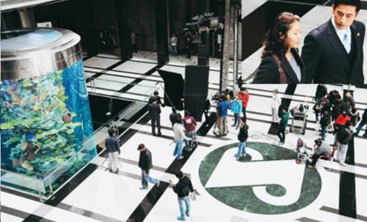

강사 - 홍성근 대표
### 교육 방향 : 포스코 특색이 나타나도록 커리큘럼 편성, 운영
### 교육내용 
- 제철보국의 포스코 창업정신 탐구
- 기업경영의 이해를 바탕으로 철강제품(자동차강판) 생산, 판매활동을 통하 경영 체험
- 직장인으로서 자기관리와 리더십 배양

### 1일차 
- 포스코 창업정신과 역사 / AI시대 신입사원의 마인드셋, 성격 유형과 다양성의 이해

### 2일차 
- 직장인의 커뮤니케이션 / 직장인의 커뮤니케이션
* 사회인으로서 신입사원 마인드셋

### 3일차
- 창업정신의 실천 (도자기 제작/ 장인정신. 창의)
* 체험을 하면 좋겠다고 생각을 해서 도자기 제작을 해볼 예정이에요 
기억에 남는 시간이 될거에요
오늘 창업정신에서 -> 장인정신 창의력을 담아서 만들어볼거야
개념이 있고 없고 차이가 있어

### 4일차
- 기업경영의 이해
- 경영 시뮬레이션 게임
* 4개 조로 도판을 제작할 거야. 협동을 위해서 (협력/도전)
각각의 인생이지만 하나의 작품을 만들어 볼거에요
신선하고 도움이 될거에요

### 5일차
- 경영 시뮬레이션 게임
- 세종 리더십과 일하는 방식
* 인터넷 게임인데요, 6개 조 -> 각각의 기업 
정신 - AI까지 세종의 정신으로 어떻게 이끌어내는지 봐줭

----------------
# 1일차 9:00
[padlet.com](https://padlet.com/skhposco/k-2607-_-fs1g48sb28wjlv6u)
<!-- <창업정신과 역사> -->

## 조 만들기
[4조 이름] - 웃조 :)
- 그라운드 어떤 마인드로 할 것인가 룰(3~5개) RULE
1. 무조건 1 의견제시
2. 긍정 마인드
3. 정색, 이탈 금지
4. 적극 참여
- 구호 : 스마일 ~

### 간단한 게임
30점 - 고양이 (답 : 고릴라)
40점 - 고추장 (답 : 고라니)
50점 - 고진감래 (답 : 고슴도치)
90점 - 고로 (답 : 가젤)
100점 - 김치찌개 (답 : 갸마헗=ㅌ가)

### 강사님 talk
인디아나 존스 마인드
내성적이어서 인디아나존스가 로망이었어
직장생활에서는 달라지려고 노력했던 것 같아요
인디아나 존스 시리즈가 끝났어요. 광고 카피때문에 좋아하게 되었어요. 만약에 모험에 이름이 있다면. 그건 인디아나 존스가 될 것이다.
도전, 모험 정신

- 모델 만들기 : 직장생활 만큼은 저렇게, 저런 마인드로 살아야겠다는 큰 무기가 돼
- POSCO : 제철 보국
psco 홈페이지에 ceo 메세지에 : 국민에게 신뢰받고 [국가 발전]에 기여하는 '자랑스런 초일류 [소재기업] 포스코그룹'을 만들어나가겠습니다.

나는 어떤 사람이 되겠다 모델을 만든다면 기업이 추구하는 모델이 되는거에요 .👆🏻

지금까지 기업을 설명하는게 돼.

기업은 흥망성대.
10대 시가 총액 순위 변화에 
카카오 김범수 이사회 사장이 도전을 두려워하지 않고 문제의 본질을 찾아 해결책을 제시하는 모습은 어제 카카오의 문화로 자리 잡았다고 말했다.

7월 16일 주가를 봤는데 카카오가 떨어졌는데 그 이유가 "카카오 창사 첫 부분 파업 돌입, 노사 갈등 정면충돌"
-> 기업의 경영철학이 흐려질 때 영향을 많이 받아
경영철학을 배우는 이유가 여기에 있어.

--------------
# 1일차 10:00
어려웠을 때 창업정신을 떠올리기 위해서
위기를 창업정신으로 돌아가서 극복하자
[기업가 정신]
- 포스코: 제철보국
- 삼성  : 사업보국
- 현대  : 도천과 개척 (candoism)
- LG    : 인화 (갈등없는 회사) 
- 한화  : 의리

### [창업정신 (조별활동)]
조별로 한 기업을 선정하여 회사의 로고를 그리고, 비전[경영철학], 핵심 가치를 찾아 적어보자
<sk 하이닉스>
- 비전[경영 철학]
구성원의 지속적 행복, VWBE를 통한 SUPEX 추구

- 핵심가치
* VWBE (Voluntarily, Willingly, Brain Engagement)

자발적·의욕적 두뇌활용을 의미합니다. 구성원이 스스로 행복을 추구할 때 발현되는 고유의 문화로, 이를 외부로 정착시킨 모습이 바로 일과 싸워 이기는 '패기'입니다.

* SUPEX (Super Excellent Level)

인간의 능력으로 도달할 수 있는 최고의 수준을 뜻합니다. 급변하는 환경 속에서 최고의 성과를 지속적으로 창출하기 위해 SUPEX를 추구합니다. 현시점에서는 한 단계 높은 수준의 목표(Better Company)를 설정하고 이를 반복적으로 달성하며 SUPEX Company를 구현해 나갑니다.

### 58년 포스코 역사
1968년 창립, 30여년 단기간에 세계 최고 수준의 기업으로 성장
조강생산량 연평균 12%, 매출액 740배, 순이익 970배 성징
- 민영화 : 정부기관이 국영화인데 정부가 주식을 가지고 있으면 국영기업이고 국민들한테 풀었어요 그래서 민영화라고 해요. 모든 국민이 포스코 주식을 살 수 있는게 민영화에요
조광이라는 것이 철광석을 녹이면 철을 추출해내는데 철 쇳물을 <RED조광>이라고 해요

조광 생산량이 세계에서 7위
위상은 세계적으로 1위를 받았어요
68-> 98년도에 포스코가 조광 생산 순위가 1위

1위 -> 7위로 다시 떨어졌는데 IMF 금 모으기 운동
어려운 시기에 투자를 해요
**30년 전** 에 있었던 회사가 없어졌는데 포스코는 살아남았잖아요. 강자야 !~!

50주년 통계 52개국 192개소

포항 인재창조원 교육 받는 곳에서 교육을 받다가 인천으로 가게 되었는데
동기 중 한명이 글로벌 네트워크에서 현지에서 직원을 채용하잖아요.
직원들을 한국에서 교육을 받게해요.
그래서 인천에 인재창조원을 만들었어요

칸 - "역사는 과거와 현재의 끊임 없는 대화다."
미국 육사 - "우리가 가르치는 이 나라의 역사는, 우리들에게 가르침을 받은 이들에게 의해 쓰여졌다."
여러분들에 의해 포스코 정신이 계승될 것이다.
교육을 받은 생도들을 통해 전승이 된다라는 의미입니다.
계속 역사는 이어진다는 거죠

📺
포스코에 창업시점에 포스코가 이뤄지고 사람이 일을했는지 영상으로 보려고 해요.
국가를 위해 일한다 라는 관점에서 보길 바랍니다.
제철보국의 사명으로 모였습니다
불가능- 도전 세계는 할 수 없다하고 우리를 믿지 않았습니다
집념으로 일했습니다. 피 땀 눈물 = 집념의 결실
1968년 영일만, 기술도 자본도 없는 곳에서 일관제철소를 위해 모인 사람들
롬멜 하우스- 희망의 상정
미친사람들. 이 일을 통해서 고생, 힘들다, 못살겠다는 사치라니까
사상 최초 대공사. 누군가는 미쳤다고하고 누군가는 무모한 도전이라하고 
우리는 반드시 해내야 했습니ㅏㄷ
우리는 생명 거는 ㅓ다 성공하지 못할 때는 죽는다고 해서 국민들에게 속죄 되는 것도 아니고, 수단과 방법을 가리지 않고 성공시켜야 한다 결의
가슴속에 제철보국 일념.
* 우향우 정신 사명
혼자 안위가 아닌 모두가 있을 때 시너지가 난다
포스코 맨 땀, 피, 눈물
사명감. 제철보국의 철, 1973,6,9일 
첫 쇳물. 만세~ 감격의 순간
성취감. 영광의 기쁨. 민족의 자존심 영일만의 기적. 
도전은 멈추지 않아 바다를 매워 포스코 개척 정신 연구
광활한 힘찬 새로운 광양만 오픈~
연약지반 -> 쓸 수 있는 방법 을 집념
자부심, 포스코의 신기술 개발 의지가 다 연결 되어 있다. 
일관제철소 꼭 해내야한다는 끈기와 정신력
조직의 힘 = 포스코의 힘

16장의 사진으로 간략하게 소개해드릴게요
1. 1943년 초창기 철을 만들어내는 용광로 8개 (삼화제철소)
2. 1967년 자금 조달을 미국을 중심으로 7개의 기업들이 펀딩을 했어요. 한국에 철강회사를 만들자 -> KISA(대한국제제철 차관단) 기본 협정 체결
67년도 로고 서울에 포스코센터 가본 적 있으신가요? 로비에 들어가면 로고가 있어영
포스코 센터 로비로 들어가도 로고를 못 봐요. 수족관 본다고 로고를 못 보더라구용.

3. 1968년 4월 1일 포항종합제철 주식회사 창립
4. 1968년 포항제철 건설본부 '롬멜하우스' (60평 목조 슬레이트)
5. 1969년 하와이 구상 KISA 자금 조달 회의 준미중 월드 뱅크 경제 보호소, 한국과 관련된 경제적인 타당성이 없어보인다. 세계 은행에서 . 그래서 kISA 차관단이 투자금 회수가 어렵겠다해서 뒤로 넘어짐. 박태준이 찾아가서 사정함. 
돈의 일부를 전용해서 제철소 건립에 자금 조달. 정부와 추진함
돌카파에마후 힐링 스톤
하와이에서 교육받으면 마음 가짐을 고쳐먹엇엉 역사의 현장에서. 지금은 어떻게 살아남을 것인가 구상의 시간었어요.
6. 1969년 한일기본협약 체결 (건설자금 확보)
7. 1970년 포항종합제철소 1기 착굥
Q. 현대조선이 영국은행으로부터 차관을 성사시켯던 해는? 1971년
8. 1971년 제선간판 ( 원료공급계약 체결 (호주))
설득 근거 : Ironmaking Plant
9. 1973년 포항종합제철소 1고로 화입
10. 1973년 6월 9일 첫 출선 순간의 만세 (철의 날)
그래서 철강의 마라톤을 진행하는 거에요
Q. 1973년 6월 9일, 포항제철 1고로에서 역사적인 첫 쇳물이 터져 나왔을 때의 표정
막중한 중압감과 두려움: "쇳물이 나오는 순간 기쁨보다는 '이제 겨우 첫걸음을 뗐을 뿐인데, 앞으로 넘어야 할 시련과 책임감이 얼마나 클까' 하는 두려움이 먼저 엄습했다."

만감의 교차: 성공의 환희 뒤에 찾아온 거대한 제철소를 이끌어 가야 한다는 부담감과 만감이 교차했기 때문이었습니다.

감격적이긴 순간에 동서양을 막론하고 만세를 하는구나~
11. <red 1977년 4월 24일 제강공장 화재사고> (국내외의 예상을 깨고 34일 만에 복구)
안전의 날로 기념하고 있어요