2일차_ 26.07.21

# 커뮤니케이션 교육과정

## AI 시대 신입사원들의 "남다른" 지혜

### 01. 경영 환경과 직장 사회의 변화
1. 세대별 추구 가치와 특징

2. 리더십 중요
눈치라는 것이 중요합니다. 이어져서 눈치는 공감능력과 비슷해요
역사 신록에도 기록되엉 ㅣㅆ어
눈치가 있는 사람. 예전에는 췌마 있는능력

#### 췌마 능력
자신의 상사가 무엇을 좋아하고 싫어하는지 빠르게 알아채는 능력으로
' 김점이 항상 조정에서 박은을 보면 반드시 큰 소리로 말하기를, "그대의 등용한 사람은 다 그대의 집에 드나들던 자요, 우리들이 부탁한 사람은 모두 들어주지 아니하니 옳은 일인가?" 하니, 박은이 대답할 말이 없었다.
박은이 비록 친척을 많이 등용하였어나, 조정의 명사를 다 뽑아 썼으므로, 남들이 심히 원망하지 아니아혔다.

박은은 췌마의 재주가 있고, 임금의 의향을 잘 맞추어 나갔다.
=> 능력

상사가 무엇을 원하는지 캐치하는 사람이 유능한 능력
보고서를 작성 TIP 
1. 상사가 보고서에 대해서 어떻게 , 무엇을 원하는 가 적혀 있는가?
상사가 원하는 글이 없다면 쓸모 없는 보고서

귀담아 들을 필요가 있겠져?

"인턴"이라는 영화가 있어요 
젊은 사장인데 조언을 받으려고 인턴으로 고용해. 처음에는 시큰둥했지만 

--------------------------------------------------------------

### 02. 커뮤니케이션의 전제조건

#### 1.  폐기학심(Unlearning)
학습했던 내용(?)을 버리는 것이 필요해요

해빙(unfreezing) -> 변화(Moving) -> 재결빙(Refreezing)

"최선을 다해라!" 항상 긍정적인 표현일 것 같나요?

talk Q I. 
갓난 아기가 자고 있다가 깼어요, 천장을 보고 있다가 허전해~ 아기가 뒤집기를 해~ 배밀이를 해~ 하다가~ 장롱 밑에 꼈부러~
아기의 그 다음 행동은?
자기가 할 수 있는 최선의 행동을 해요
' 배밀이로 앞으로 전진 but 실제로 상황을 더욱 악화시킬 뿐 '

어떤 문제에 직면을 하면 찐 문제에 대해 원인을 몰라
실제 상황을 더 악화시킬 것이다.
섣불리 최선을 다해라 하는 것은 좋지 않아.
더 좋지 않은 상황으로 빠질 수 있어.

사람마다 두 마리의 개가 있다고 해요~ 
##### 1. 편견
##### 2. 선입견

talk Q II.
우리 생애 최고의 순간 - 2008년 스포츠/영화 (넷플)

최고의 순간은 결과가 아닌 과정과 열정에 있다.
비인기 종목과 여성 스포츠인들의 현실적 서러움
서로의 상처를 보듬는 연대와 팀워크

를 영화를 보며 느끼고 배울 수 있음

독수리
다람쥐
닭
두더지(답: 당나귀)
돌고래

#### 2. 지식의 저주(cOURSE OF KNOWLEDGE)
다른 사람의 행동이나 반응을 예상
자기가 알고 있는 지식을 다른 사람도 알 것이라는 고정관념에 매몰되어 나타나는 인식 왜곡

내가 알려고 하는 것도 상대방도 피드백 하겠지~ 라는 오류

#### 3. 감성역량의 이해
오늘 가장 중요한 개념이야
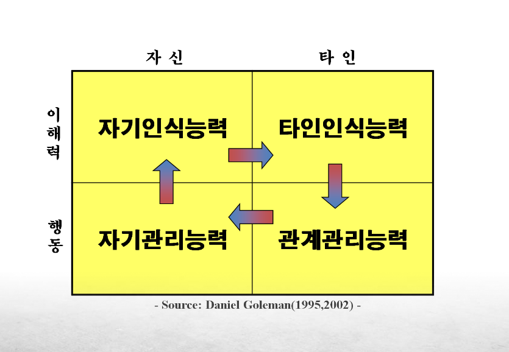

감성+역량 = 개인 역량

자기 관리 능력. - 충동이나 부적절한 감정을 통제하고, 목표를 향해 유연하고 성실하게 대응하는 능력
자기 인식 능력. - 자신의 강점, 약점, 감정 상태, 그리고 그것이 타인에게 미치는 영향을 명확히 파악하는 능력 
타인 인식 능력. - '눈치' 빠르노~ 타인의 감정, 필요, 우려를 이해하고 조직의 정치적·감정적 기류를 읽는 능력
관계 관리 능력. - 타인과의 관계를 형성 및 유지하고, 동기를 부여하며, 영향력을 행사하는 능력

위 4가지가 다 있어야 돼
1가지라도 빠져 있으면 결여된 사람😜

어떤 것을 고전이라고 생각하나요?
개인적으로 '고전'은 누구나 다 알고 있지만 정작 나는 읽지 않은 책.
삼국지는 웹툰, 단행본 등등 알고 있어요. 

삼국지에서 감성역량이 발휘된 사례
-  조조

조조의 목표
: 통일 제국 건설. '황제' 명분과 실제 군사력으로 천하를 지배하려고 함. 

1. 자기인식 (Self-Awareness)
“나 솔직히 명문가 출신도 아니고 좀 칠칠치 못함.”

상황: 세력도 작고 출신도 환관 집안이라 명문가 원소한테 밀릴 때.

센스: 자기 약점을 대놓고 인정하고, 대신 깐깐한 참모들(순욱, 곽가) 말만 딱 듣고 실속 차림.

2. 자기관리 (Self-Management)
“다 타죽게 생겼는데 복병도 안 두다니, 유비 멍청이 ㅋㅋㅋ”

상황: 적벽대전에서 불타서 다 잃고 도망치는 와중.

센스: 멘탈 터질 상황에서 웃으면서 농담 던짐. 리더가 안 쫄아야 부하들도 산다는 걸 알아서 감정 완벽 컨트롤!

3. 타인인식 (Social Awareness)
“너희가 배신하려고 쓴 편지? 안 보고 다 불태운다!”

상황: 관도대전 이기고 보니, 부하들이 적한테 목숨 구걸하려 보낸 편지 무더기 발견.

센스: “나도 무서웠는데 니들은 오죽했겠냐.” 부하들의 인간적인 공포를 읽고 편지를 불태워 민심 완벽 흡수.

4. 관계관리 (Relationship Management)
“내 아들 죽인 놈이라고? 능력 있으면 사위 삼아야지.”

상황: 장남과 최애 장수를 죽인 원수 '가후'가 항복해 옴.

센스: 사적 원한 싹 잊고 핵심 참모로 등용. 심지어 사돈까지 맺으며 확실하게 내 편으로 만듦!

### 03. 커뮤니케이션 실체

📺 리더십과 자기기만(Self-Deception)
1. 시대적 배경: 무지와 미신의 시대 (1846년 오스트리아 비엔나)
의학계의 무지: 세균 개념이 없던 시절로, 질병은 악취나 체액의 불균형 때문에 생긴다고 믿었습니다.

위험한 의약품: 유해한 화학물질이나 중독성 물질이 의약품 및 의료 용품으로 무분별하게 사용되던 시대였습니다.

비엔나 종합병원의 비극: 출산 후 산모들이 고열에 시달리다 사망하는 일명 '산후열(Childbed Fever, 유아 침대 고열 질병)'이 급격히 확산되었습니다.

2. 의문과 조사: 두 병동의 극명한 사망률 차이
제1병동 (죽음의 병동): 의사와 의대생들이 담당. 산모 사망률 매우 높음 (사망자 수 大).

제2병동: 조산사(간호사) 교육생들이 담당. 산모 사망률이 상대적으로 매우 낮음.

기존 권위의 무시: "1병동이 더 혼잡하니까 사망자가 많은 게 당연하다"며 문제를 치부하고 도움을 주지 않음.

제멜바이스의 홀로 조사: 통념에 타협하지 않고, 두 병동의 실제 작업 방식과 환경 차이를 혼자서 정밀하게 파헤치기 시작함.

3. 결정적 단서와 가설의 증명
동료 제이콥 콜렛츠키(Jakob Kolletschka) 박사의 사고:
시체 해부 도중 실수로 칼에 찔리는 사고가 발생. 이후 산후열 산모들과 완벽히 유사한 증상을 보이며 사망함.

원인의 포착:

"시체 부검 시 묻은 오염 물질이 체내로 들어가면 산후열과 같은 병을 일으킨다."

제1병동 의사들은 시체 해부 후 손을 씻지 않고 곧바로 산모의 출산을 도왔음. (반면 제2병동 조산사들은 해부 실험을 하지 않음)

해부 실험을 줄였을 때 사망자 수도 함께 감소하는 경향을 확인함.

4. 해결책 실행과 경이로운 결과
해결책 제시: "손을 깨끗하게 씻자!"

반발: 당대 의사들은 이를 "모욕적"으로 받아들임 (자신들이 질병을 옮기는 주범이라는 사실을 부정).

강력 세척제 도입: 제멜바이스는 손의 오염 물질을 제거하기 위해 '염화 석회수'로 손을 강박적으로 씻도록 조치함.

결과: 제1병동의 산모 사망률이 폭락하며, 자신의 가설이 틀리지 않았음을 논리적이고 명확한 증거 데이터로 입증함.

5. 시대의 한계와 위대한 업적
기득권의 거부: 명확한 증거와 실적에도 불구하고, 당시 의사들은 "신사적인 의사의 손이 질병을 퍼뜨릴 리 없다"며 자신의 과오를 부정하고 제멜바이스의 주장을 배척함.

역사적 평가: 시대는 그의 발견을 즉각 받아들이지 못해 비극으로 끝나는 듯했으나, 훗날 세균학의 발전과 함께 그의 집념은 '현대 감염 예방 및 손 씻기 수술법'의 기틀을 마련한 위대한 업적으로 평가받게 됨.

💡 요약: 문제 해결을 위해 찾아봐야 할 곳
편견 버리기: 권위나 관습이 제시하는 단순한 핑계("혼잡해서 그렇다")를 의심할 것.

비교와 대조: 잘되는 집단(2병동)과 안되는 집단(1병동)의 행동 패턴 차이를 관찰할 것.

가장 가까운 관행 점검: 외부 요인이 아닌 내가/우리가 매일 반복하는 행위(손 씻지 않음) 속에 원인이 있는지 찾아볼 것.

- 
당연하게 여기던 일상을 객관적으로 의심하고 현장에서 원인을 찾을 때 진짜 해결책이 시작되며, 이를 받아들이는 겸손함이 모일 때 비로소 발전이 이루어진다.

미세한 행동 차이로 당연하게 행하던 관습과 프로세스를 객관적으로 보자
- 

병원 목표 : 사망률을 줄이자
<제멜바이즈>  - 병원균이 의사 손에서 발병한다는것을 알게 되었지만
1. 공격적이고 거친 소통 방식 (관계 관리 부족)
상대방을 모욕하는 언행: 그는 의학계 동료와 스승들을 향해 "살인자", "무지한 도살자"라는 극단적인 표현을 서슴지 않았습니다.

방어기제 자극: 아무리 옳은 말이라도 상대방을 정면으로 공격하면 반발심만 키우게 됩니다. 당대 의사들은 그의 메시지(손 씻기)보다 공격적인 전달 방식에 반감을 느껴 귀를 닫아버렸습니다.

2. 설득과 공감 접근법의 부재 (타인 이해 부족)
상대방의 자존심 고려 미흡: 당시 의사들은 사회적 지위가 높은 신사들이었습니다. 제멜바이스는 "당신들의 손이 오염되어 산모를 죽이고 있다"는 사실을 상대방이 충격을 줄이고 받아들일 수 있도록 전략적으로 설득하는 과정(소프트 스킬)을 생략.

동료를 우군으로 만들지 못함: 학계의 마음을 얻기보다는 자신의 의로운 분노에 집중한 나머지, 뜻을 함께할 의사나 제자들을 조직적인 우군으로 포섭하지 못 함.

-----------------
• 사람들은 문제의 근본적인 원인이 자신에게 있을 수 있다는 사실을 간과한다
• 사람들에게는 문제를 감추려는 경향이 있다                   <!-- # (너모너모 아쉬웡) -->
• 사람들은 문제의‘올바른’해결책에 대하여 저항할 수 있다

-----------------------------------------------------------------

### 04. AI 시대 신입사원들의 남다른 지혜
#### 1. 프레임 전환 _ 사람을 보는 두 가지 방식
40대 꽃 선물 - 반응
* 싫어합니다. (돈으로 줘/ 뭐 잘 못 했어?) 99%

리더십은 30cm 차이다. = 실행  여부
나와 무관한 사람 - 내가 무언가를 해줘야 하는 사람

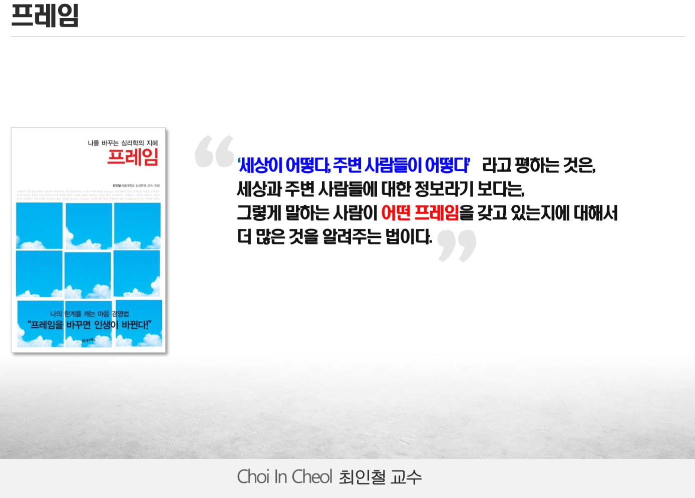
취업을 위해 자소서를 쓰죠, 나를 소개하는 서류잖아요.
취업을 했어, 그 후로는 이직을 하지 않는 이상 쓰지 않죠
이력서는 다른 사람이 써줘요.
근무 부서의 신입사항, 이력서, 주변사람이 써줘요
어떻더라~ 카더라~ 마음 속에는 어떤 사람인가 인식이 돼
말과 행동 -> 그 사람의 이력이 돼

그 사람이 바라보는 그 사람에 대해 어떻게 생각하고 있냐라는 거에요
"평가" 프레임이 맞을 수도 틀릴 수도 있죠

#### 2. 행동보다 더 중요한 것
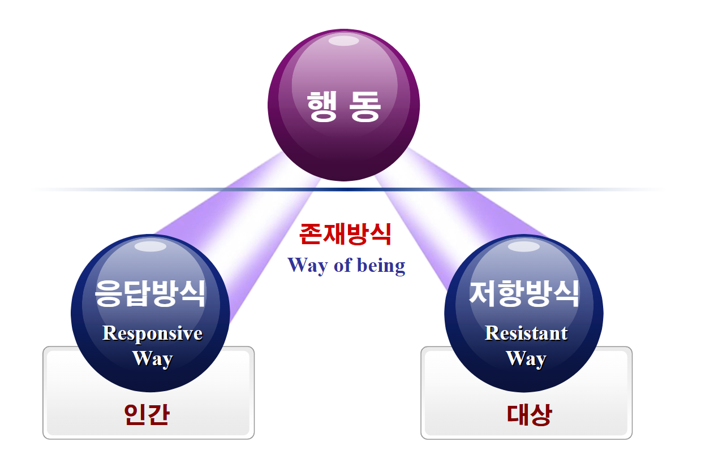

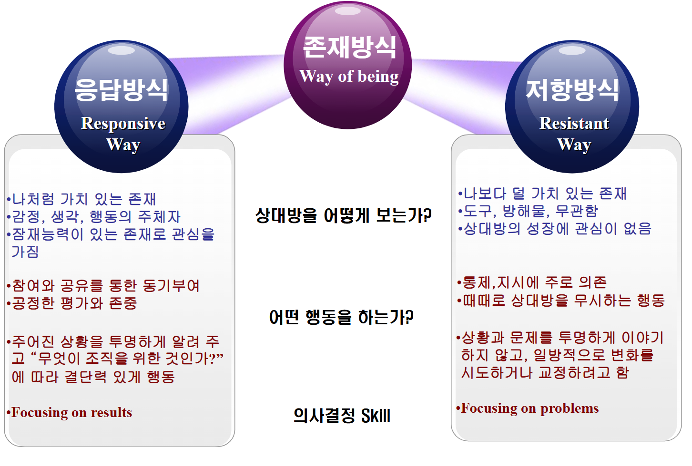

- 행동을 통해 바라보는 인식
    -> 인간 (배려) - 도와줘야 하는 동료
    -> 대상 (이용) - 장애물이 되는 동료
 
 소감 중
 기대하고 왔다 팀장님 보고 실망했다.
 왜 실망했누
 내가 팀장님 경험과 지식이 있어서 기대하고 왔는데, 노하우를 안 알려줘서
 인간적으로 대접했더니 대상 취급당했쩡

-------------------------
📺 벤허 
말을 대하는 방식

첫 바퀴에 이기는게 아니라 마지막 바퀴에 이겨야 해
혼자 이길 수 없어 협력해야 해
--------------------------

조직의 목표
개인의 역량 - 역할과 임무

--------------------------
#### 3. 성과에 이르는 방법 - 리더십 다이아몬드 모델

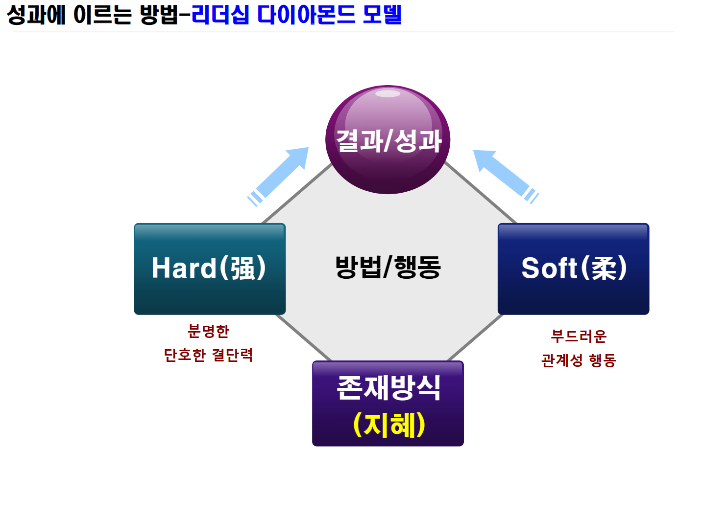

============================================================

## 학습 내용 Review

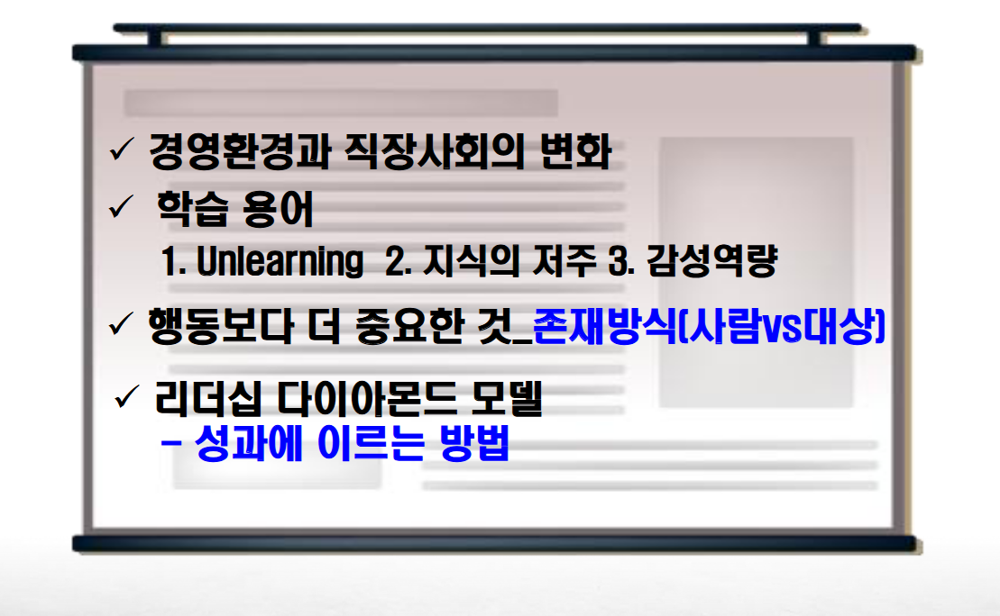

감성역량이 가장 중요해
존재 방식의 관점도 중요해
(상대도 알아 어떻게 대하는지)
성과는 soft/hard 둘 다 가능하다는거~

-------------

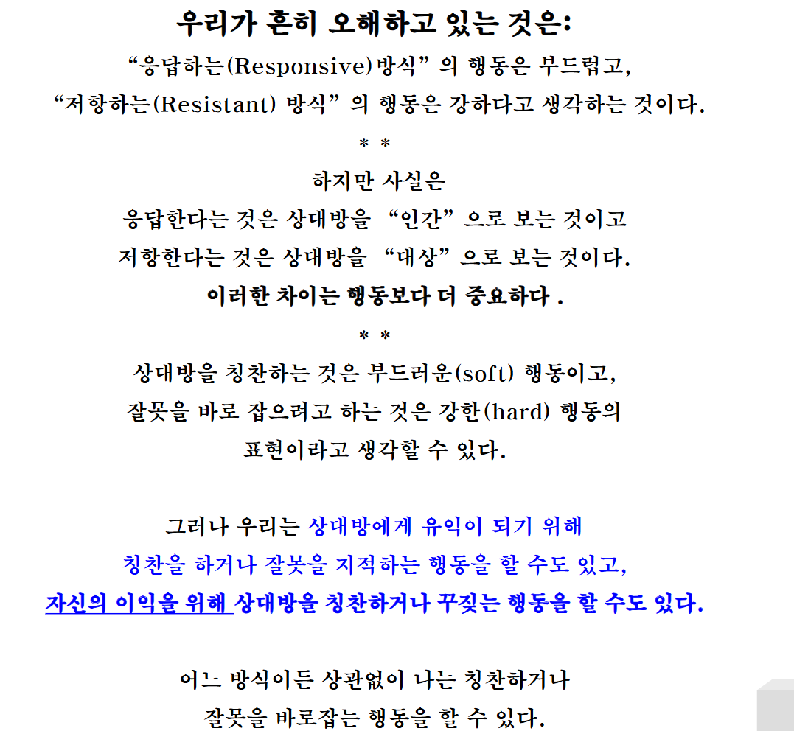

상대방에게 유익이 되기 위해 칭찬을 하거나 잘못을 지적하는 행동을 할 수 있고, 자신의 이익을 위해 상대방을 칭찬하거나 꾸짖는 행동을 할 수도 있다.

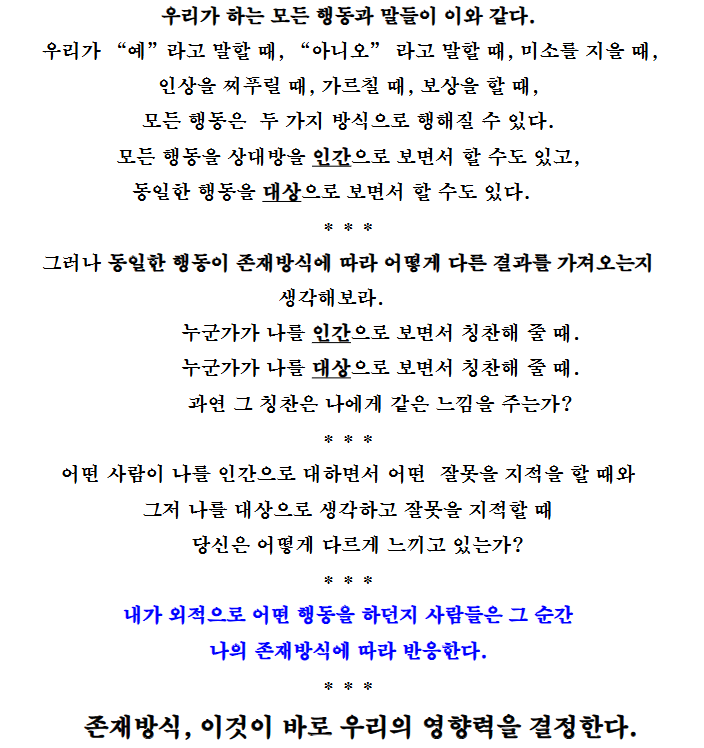

(ex) 갑과 을의관계
인간성, 조직 내 인간관계, 능력 굿굿 (칭찬)
본인은 칭찬을 불평을 하더라 가식이어서 불쾌 😡
상대가 대상으로 봤다는 걸 안다는 거~

존경과 배려의 마음을 가지고 있어야겠지?

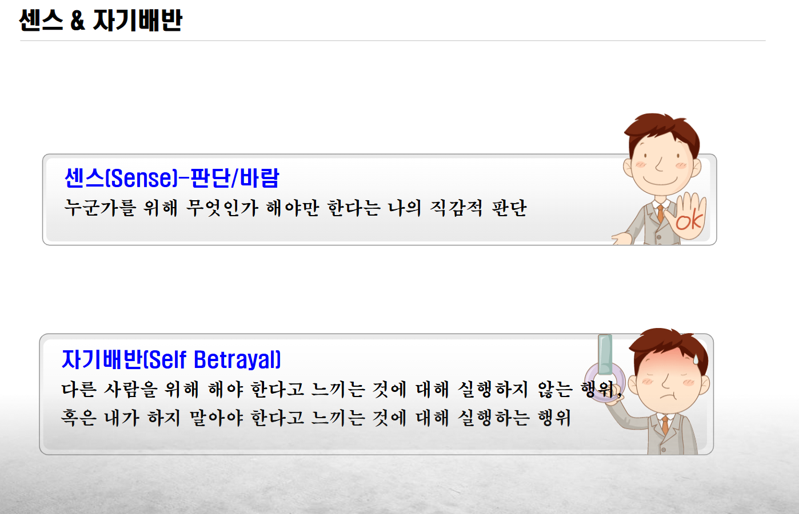

SENSE (센스) - 판단/바람
누군가를 위해 무엇인가 해야만 한다는 나의 직감적 판단.

SELF BETRAYAL (자기 배반)
다른 사람을 위해 해야 한다고 느끼는 것에 대해 실행하지 않음
or 내가 하지 말아야 한다고 느끼는 것에 대해 실행하는 행위

=> 일상생활에서 흔히 일어남 ㅋㅋ

------------------------------------------------------------

### 센스 [나는 누구를 위하여 무엇을 해야 한다]
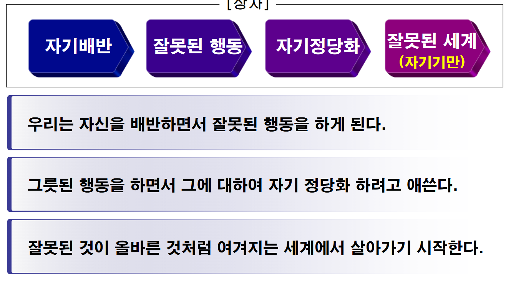

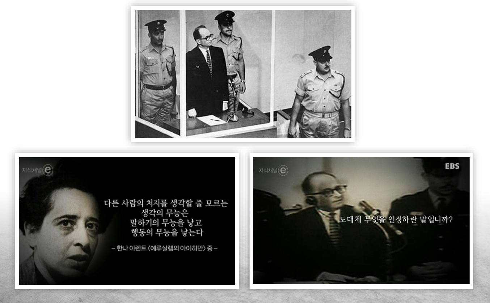

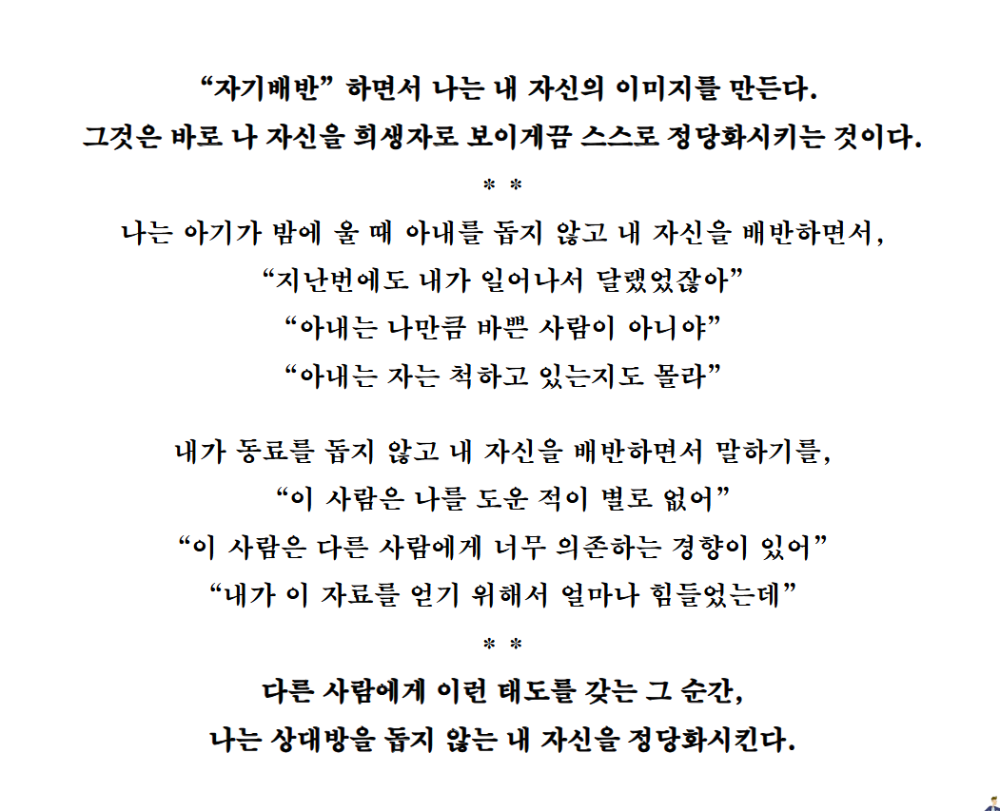

내가 도와야겠다는 센스를 행동 안함
but 정당화 (배반)
살짝은...필요 없...나...?

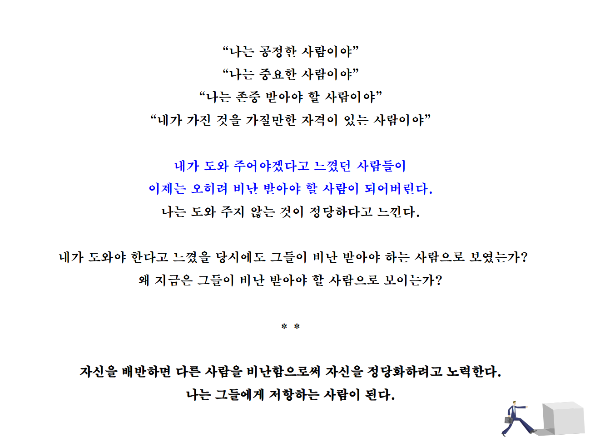
에이 비난까지는,,,

### '내가 자기배반 했다는 것'을 인식하지 못하는 것
= 상자 안으로 들어간다
자기배반 ---> 파장 ----> 공보........;
자기배반은 또 다른 자기 배반을 유발시킨다
<-> 두 사람 혹은 그 이상의 사람들이 상대에게 자기배반 하도록 만듦

| 내 자신을 배반함으로써, 내가 몹시 싫어하는 행동을 상대방이 하도록
야기시키고 있는 것이다. 그리고 그들도 자신을 배반함으로써,
그들이 싫어하는 그 행동을 내가 하도록 유도하고 있는 것이다.
우리는 서로 비난하면서 고통과 불행이 지속되도록 협력하고,
우리의 긍정적인 에너지를 거의 소모하고 있다.
선순환의 모델이 되지 못하고 있는 것이다. |

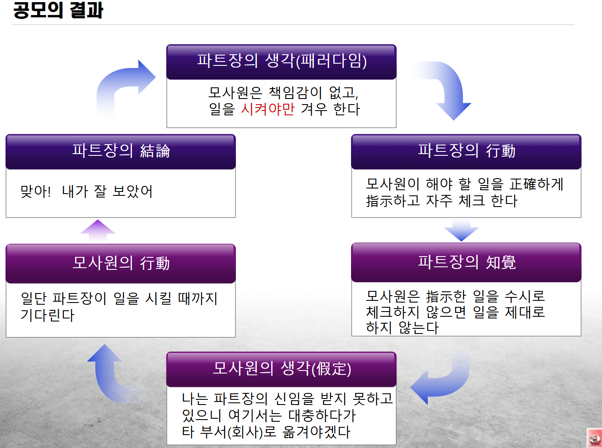

실습 time~
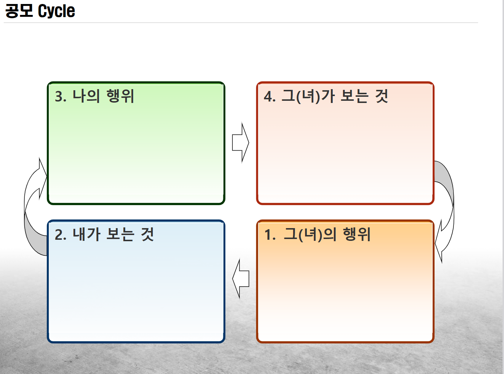

갱장이 중요해여