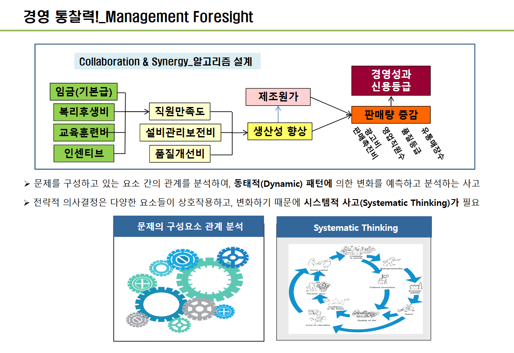

기업 경영 시뮬레이션

# 목차

1. 기업경영의 이해

2. 경영 시뮬레이션 게임

# 기업경영의 이해

'시' 영화 소개

FM 라디오 저녁스케치 음악 방송

------
## 기업 조직 _ Value Chain

생산/운영 관리

마케팅 관리

인사/조직 관리

재무/회계 관리

## 01. 기업/스타트업 창업 등 비지니스 용어
### 1. 마케팅
- [ 생산자가 상품 또는 서비스를 소비자에게 유통시키는 데 관련된 모든 체계적 경영활동 ] 

- 마케팅 믹스
생산자가 상품 또는 서비스를 소비자에게 유통시키는 데 관련된 모든 체계적 경영활동

* 제품 - 가격 - 촉진 - 유통

#### (1) 수요곡선

수요의 가격 탄력성

#### (2) 발주량

어떤 기준으로 주문을 할 것인가?
1. 한 달 동안 몇 잔 판매할 것인가?
2. 현재 매장에 원두가 얼마나 있는가?
3. 원두 재고를 확보해 놔야겠다. 재고가 없다면 단체 손님이 와도 수요가 있는데도 불구하고 못 파는 경우를 대비해서 

발주량 = 예상 판매량 - 현재 재고량 - 안전 재고량

### 2. 생산관리

- 경영의 생산활동을 능률화하고, 생산경력을 최고로 발휘시키기 위한 관리방법

#### (1) 규모의 경제

- y 축 : 금액

- x 축 : 수량

* 변동비 , 고정비

단위생산원가 = 총 비용에서 생산량을 나누면

- 생산 규모의 확대에 따른 생산비 절약 또는 수익향상

### 3. 인사관리

- [기업(조직)의 구성요소인 인적 자원으로, 잠재능력을 최대한 발휘, 최대한의 성과를 달성하여, 만족을 얻게 하려는 체계적인 관리활동]

전공이 뭐야? 회계 언어 하고 있나? 회계는 경영의 언어니까

= 회계를 보려면 경영을 할 수 있으니 전경 불문하고 회계의 기초적인 개념은 숙지해 둬야해.

회계 자료는 숫자로 표현되어 있어요

숫자는 경영 의사결정의 스토리를 가지고 있으니

재무재표를 보고 숫자에 담겨 있는 것을 유추해서 경영활동을 해 봐

### 4. 재무관리

금융시장 Financing -> 자금 운용 Operating -> 투자 Investing

- 내가 커피 매장을 운영한다면?
    사업자금 마련 : 내 돈 (**자본**), 남의 돈 (부채) 이것 으로 마련한 것? -> 자산

    < 회계 등식 >
    자산(**Assets**) = 부채 + 자본
    - 부채 : 갚아야 할 돈, 외상매입금, 은행대출
    - 자본 : 납입 자본금(주식), 이익잉여금

- 재무제표(Financial statement)
: 회사 돈에 대한 정보를 알려주는 여러가지 표
    ⭐ 재무상채표(Statement of Financial Position, B/S : Balance sheet)
    ⭐ 손익계산서(Income Statement)
        - 제조업 : 매출액
        - IT, 서비스업 : 영업수익
    ⭐ 현금흐름표 (Statement of Cash Flows)

#### (1) 📊 손익계산서
: 일정기간 동안의 기업의 경영성과를 한 눈에 나타내기 위하여, 어떤 활동을 통해 수익과 비용을 기록한 재무제표를 말한다.

I       매출액
II      매출 원가
III     매출 총 이익
IV      판매 및 관리비
V       영업이익 = 판매 및 관리비를 뺀 값
VI      영업외 비용
VII     경상이익
XII     당기 순 이익

##### 1. 단계별 계산 공식 (Income Statement Structure)

[ I. 매출액 (Revenue) ]
       │
       ▼  (-) II. 매출원가 (COGS)
[ III. 매출총이익 (Gross Profit) ]
       │
       ▼  (-) IV. 판매비와 관리비 (SG&A)
[ V. 영업이익 (Operating Income) ]  ★ 본업의 성과
       │
       ├─ (+) 영업외수익 (Non-operating Revenue: 이자수익 등)
       └─ (-) VI. 영업외비용 (Non-operating Expense: 이자비용 등)
       │
       ▼
[ VII. 경상이익 (Ordinary Income) ]
       │
       ▼  (-) 법인세 비용 (Corporate Tax)
[ XII. 당기순이익 (Net Income) ]     ★ 최종 남은 돈

----

맞습니다! 회계 실무와 주식 투자에서 "당기순이익만 믿고 투자하거나 판단하면 발등 찍힌다"는 말이 있을 정도로 당기순이익에는 착시와 착오를 일으키는 요소(함정)가 많습니다.

당기순이익을 볼 때 반드시 주의해야 하는 5가지 이유를 정리해 드립니다.

💡 당기순이익을 볼 때 주의해야 하는 5가지 이유
1. ‘일회성 착시’ (본업과 상관없는 착한 척)
상황: 회사가 가진 건물이나 공장 부지를 팔아 1,000억 원의 시세 차익이 생겼습니다.

결과: 본업은 적자인데, 건물 판 돈(영업외수익) 때문에 당기순이익이 엄청나게 흑자인 것처럼 보입니다.

주의점: 건물은 매년 팔 수 없습니다. 이 이익은 지속성이 없는 '일회성 럭키'일 뿐입니다.

2. ‘현금 흐름과의 불일치’ (흑자도산의 위험)
상황: 물건을 100억 원어치 팔아서 '외상(매출채권)'으로 기록했습니다.

결과: 손익계산서상 당기순이익은 100억 원 흑자이지만, 실제 통장에는 돈이 1원도 안 들어왔을 수 있습니다.

주의점: 회계는 '발생주의'를 따르기 때문에, 돈을 못 받아도 이익으로 잡힙니다. 외상이 밀려 통장에 현금이 없으면 흑자인데도 망하는 '흑자도산'이 발생합니다.

3. ‘회계적 조작 및 착시’ (비용을 자산으로 숨기기)
상황: 연구개발(R&D) 비용 50억 원을 썼습니다.

처리 방식:

비용(판관비) 처리 ➡️ 당기순이익 감소

자산(무형자산) 처리 ➡️ 당기순이익에 영향 없음 (순이익 부풀리기)

주의점: 개발비나 마케팅비를 자산으로 잡아 당기순이익을 예쁘게 꾸미는 회사가 있으므로, 재무제표의 주석을 살펴봐야 합니다.

4. ‘주식 수 변동’ (배당/주가 착시)
상황: 당기순이익이 작년 100억 원에서 올해 100억 원으로 똑같습니다.

변수: 그 사이에 회사가 유상증자를 해서 주식 수가 2배로 늘어났다면?

주의점: 주주 한 명당 돌아가는 1주당 순이익(EPS)은 반토막이 난 것입니다. 전체 당기순이익 액수만 보면 이 착시를 놓치게 됩니다.

5. ‘환율 및 평가손익’ (장부상의 숫자일 뿐인 돈)
상황: 달러나 외화 부채, 주식/펀드 자산을 많이 가진 기업.

결과: 평가 환율이 바뀌거나 평가 금액이 올라 장부상 당기순이익이 크게 변합니다.

주의점: 실제로 자산을 팔아 현금화한 것이 아니라 '장부상 평가액'만 바뀐 것이므로 실질적인 기업 가치 상승으로 보기 어렵습니다.

##### 현금 흐름표
현금흐름표는 일정기간 기업의 현금 변동 사항에 대해 확인할 수 있다.
수입과 지출을 영업활동, 재무활동, 투자활동으로 구분한다.

##### 재무상태표

# 경영 시뮬레이션 Biz - Manager 교육

기업 현실과 유사한 상황에서 가상 기업을 경영하는 경영자의 역할을 수행하면서, 자연스럽게 경영의 큰 흐름을 이해하고, 경영성과 창출과 경영의사결정 능력을 성찰하고 향상하는 교육

분기로 잘라서 할거야 
분기를 - 1년으로 잡을게
총 4년을 볼거야 

 
소재는 psco 냉연강판 부품을 자동차 강판으로 만들거임

한국에 생산공정이 있으면 미국 중국엔 없음 그러나 신설 가능
현재 6개 조는 동일하게 경영 성과와 경영 자원은 모두 동일함

고려사항 - 경영 성과를 창출해야함(수익), 성장 잠재력을 키워나야됨.
튼튼한 기업, 성장가능성 부분인데 물려줘야지

13번째 경영부터 시작
- 철강제품 생산
- 초기 250억
- 주식수 5백만 주   * 5000원 = 250억
-  부채 없음
- 공장은 한국 1개
- 생산라인 수 6개 증설됨 (최대 8개까지 증설 가능(추가 시 비용 발생))
- 영업본부 (한국, 미국, 중국)
- 유통 매장 한국 30 미 15 중 15
- 영업 직원 250 /130/130

신제품은 5 - 6 ------ 가능 ㅇㅇ 현재는 4
품질 등급은 4
1~ 7등급 등급은 낮을수록 좋음

---
13시-14시 회의

경제환경, 정치/법률 환경, 기술환경, 사회 문화적 환경 등을 봐야해

방향성을 정하면 임원들은 그 방향성에 맞게 가야해

성장전략, 안정 전략, 축소 전략 등을 고려해야 함

손익추정, 실제와 비교해 봐.
실제 값들이 찍혀 나옴

----
# 5day
---

경쟁사 분석 -> 우위에 있는 것이 무엇인가?, 경쟁사 보다 떨어지는 것을 경쟁사 수준 만큼 끌어 올리는 것
손익 분석, 제조 원가 분석, 
3 라운드는 수익성 분석, 현금흐름 분석

제조 단가
한국 미국 중국의 수익 시장별 분석 -> 

현금흐름 분석 굉장히 중요해요. 
어떤 마인드를 분석해 봤더니 현금흐름 분석이 보이더라고
3라운드 부도가 3팀이 있어요. 부도 원인은 뭔가요 현금 부족과 () 

결과를 보고 리뷰를 한 번 해줄게요
제가 여러분 전에 포스코에서 취준생 대상 교육을 오래 했어요. 취업에 필요한 것을 전달하는 교육이었는데, 그 중에서 경영시뮬레이션을 하기 위해서 입과하는 경우가 있더라고요

여기서 배우는게 있지 않을까요?
취업을 했을 경우, 시뮬레이션 종류가 많은데, 울산 현대중공업 신입사원교육에 가서 했는데 2사람이 찾아왔는데, 교육을 받고 취업을 해서 신입사원 교육 때 다시 만나는 것.

꼭 언제 이 교육을 받았다 말씀해 주시고
'조'명을 말해 주면 좋을 것 같앙.

3라운드 

매출액이 적으면 영업이익에서 흑자글 가져오지 못해여

3라운드는 모델 5로 경쟁을 했는데 경쟁이 꽤 심했어요
스마일 팀이 115억으로 흑자와 주가가 올랏네요

3조는 반전이 될 기업이 있는게 데이터를 보면 알 수 있어

4브랜드 등급이 떨어진다는 것은 고객 인지도가 없는거에요 같은 모델인데 품질이 떨어지면 거른다

은행 대출가 회사 채권이 있는데
은행 대출이 단기고
회사 채권이 장기에요

단기 은행대출을 받았는데 2라운드때 100억을 받았어요 자금 유입이 되었는데 

CEO가 잠 못 들어 하는 이유는?

2. 전략적 의사결정 프로세스[질문법]

- 직관(Intuition)이 없다면 프로세스에 따라야...

[ 만일 나의 생명이 그 문제를 해결하느냐 못하느냐에 걸려 있는 상황에서 단 한 시간이 주어진다면, 첫 55분 동안은 적절한 질문을 찾는데 보내고 나머지 5분은 그 문제를 해결하는데 보낼 것이다. 
- 아인슈타인 - ]

### 전략적 의사결정 프로세스 [4단계]

#### 1. 인식론적 겸손을 가졌는가?
Humble Decision Marker?

: 겸손한 마음을 가졌는가? 확신이 있는 경우에도 상황에 따라 나의 결정은 틀릴 수 있다 라는 것을 인지하는 것.

#### 2. 선택할 수 있는 대안은 어떤 것이 있는가?
Opportunity cost?
보통 우리는 두가지 중 하나를 선택하는 경우가 있다.

#### 3. 경쟁사를 읽고 있는가?
- 재무분석 시나리오 경영, 경쟁우위전략

#### 4. 검증의 과정을 거치고 있는가?
- 계획과 사전예측

#### 5. Cash in Hand & 지속가능성

----

# Red Queen Effect

기업이 현재의 시장 점유율을 유지하기 위해 지속적으로 신기술을 개발하고 마케팅을 강화해야 하는 상황을 설명할 때 자주 쓰입니다. 경쟁사들이 모두 발전하고 있기 때문에, 혁신을 멈추는 것은 제자리에 머무는 것이 아니라 퇴보하는 것을 의미합니다.

---

선순환
이용 증대 / 투자 증대 / 생산,판매 활동 증대 / 높은 경쟁력 / 발전 및 성장

악순환
이용 감소 / 투자숙소/ 생산,판매 활동 축소 / 낮은 경쟁력 / 시장 퇴출 

---

현금 흐름을 관리하라

현금이 기말 현금이 은행 대출로 확보한 것인지 그럼 갚아야되니까 그것 까지 봐야함

----

임금의 하방유연성(Wage Downward Flexibility) 또는 임금의 하방강직성(Wage Downward Rigidity)

경제학에서 '임금의 하방강직성'이란 경기 침체나 기업의 실적 악화, 노동 공급의 과잉 등으로 인해 임금이 내려가야 하는 상황이 되어도 현실에서는 임금이 잘 떨어지지 않는 현상을 말합니다. 즉, '위로는 올라가기 쉬워도 아래로는 내려가기 어렵다(하방이 막혀있다)'는 뜻입니다.

🔑 임금의 하방강직성이 발생하는 주요 원인
최저임금제도 등 법적 규제:

법적으로 정해진 최저임금이 존재하기 때문에, 경기 상황이 아무리 안 좋아도 일정 수준 이하로 임금을 낮출 수 없습니다.

노동조합과 단체협약:

강력한 노조의 존재 및 단체협약으로 인해 기업이 단독으로 임금 삭감을 단행하기 어렵습니다.

장기 근로계약:

보통 1년 단위 이상의 연봉 계약이나 호봉제를 채택하고 있어 시장 상황이 변한다고 해서 즉시 임금을 인하하기 힘듭니다.

효율성 임금 이론 (Efficiency Wage Theory):

기업이 노동자의 사기 저하, 이직률 증가, 생산성 감소, 우수 인재 유출 등을 우려해 시장 균형 임금보다 일부러 높은 임금을 유지하려고 합니다.

화폐 착각 및 심리적 저항:

노동자들은 명목 임금이 삭감되는 것에 대해 매우 강한 거부감과 상실감을 느낍니다. (실질 임금이 동일하더라도 명목 금액이 줄어드는 것에 크게 반발함)

📉 임금의 하방강직성이 경제에 미치는 영향
고용 조정(해고 및 채용 축소)의 심화:

기업이 불황을 맞았을 때 '임금 삭감'을 통해 비용을 줄이기 어렵기 때문에, 결국 '인원 감축(해고)'이나 '신규 채용 중단'을 선택하게 됩니다.

실업률 증가:

노동 공급이 수요보다 많아지면 가격(임금)이 떨어져서 균형을 맞춰야 하는데, 임금이 내려가지 않으므로 구직난과 비자발적 실업이 길어집니다.

물가 상승 압력의 지속:

경기 하강기에도 인건비 고정비용이 줄어들지 않아 제품 가격 하락을 방지하거나 물가 상승을 자극하는 요인이 됩니다.

------

### 시스템 알고리즘 설계(예시)

### 투자 => 경영 성과 창출 방법

1. 직원 만족도 ⭐⭐⭐ (임금(기본급), 복리후생비, 교육훈련비, 인센티브) CHO

2. 설비관리보전비                                                   

3. 품질개선비

=>      ⭐⭐ 생산성 향상 ⭐⭐

-> 제조원가
=> 판매량 증가 -> 경영성과 신용등급 향상

### 경영 통찰력

1. 경영의사 결정은 경영자로서 문제해결력

2. 현업에서 직면하는 문제

---
# 교훈 2가지만 얻고 가자

💡💡 문제를 구성하고 있는 요소 간의 관계를 분석하여, 동태적(Dynamic) 패턴에 의한 변화를 예측하고 분석하는 사고

💡💡 전략적 의사결정은 다양한 요소들이 상호작용하고, 변화하기 때문에 시스템적 사고(Systematic Thinking)가 필요

각각의 성과가 모여 기업 성과가 나옴.

큰 그림을 그릴 수 있게 도와줬다잉~

---

input 대비 output 성과를 내는 것이 생산성 향상 ~

경영시뮬레이션을 반나절을 했는데 

알고리즘을 빨리 캐치해서 따라오더라고 ~  + 토론 활성화

시뮬레이션을 통해 생산성을 높일 수 있는 것을 수행을 했는데

어떤 것을 하면 생산성을 높일 수 있는ㄱ