기업 경영 시뮬레이션

# 목차

1. 기업경영의 이해

2. 경영 시뮬레이션 게임

# 기업경영의 이해

'시' 영화 소개

FM 라디오 저녁스케치 음악 방송

------
## 기업 조직 _ Value Chain

생산/운영 관리

마케팅 관리

인사/조직 관리

재무/회계 관리

## 01. 기업/스타트업 창업 등 비지니스 용어
### 1. 마케팅
- [ 생산자가 상품 또는 서비스를 소비자에게 유통시키는 데 관련된 모든 체계적 경영활동 ] 

- 마케팅 믹스
생산자가 상품 또는 서비스를 소비자에게 유통시키는 데 관련된 모든 체계적 경영활동

* 제품 - 가격 - 촉진 - 유통

#### (1) 수요곡선
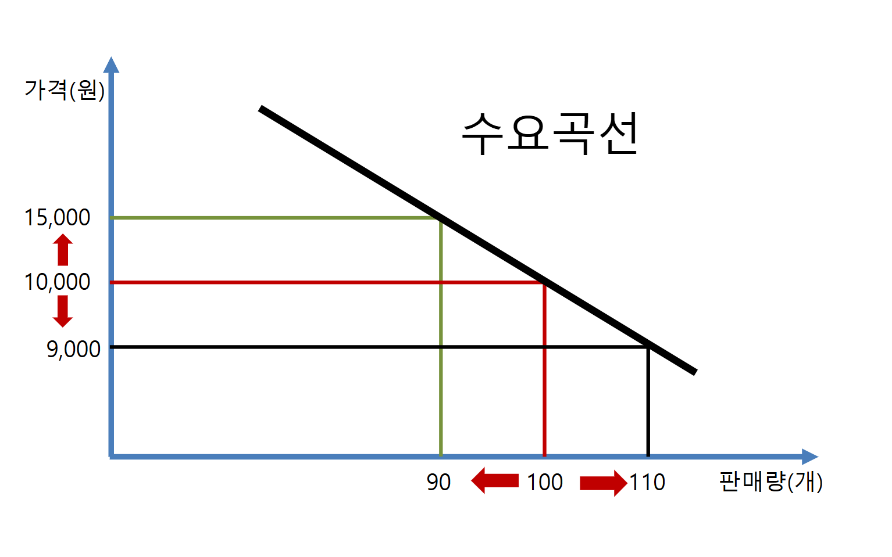
수요의 가격 탄력성

#### (2) 발주량
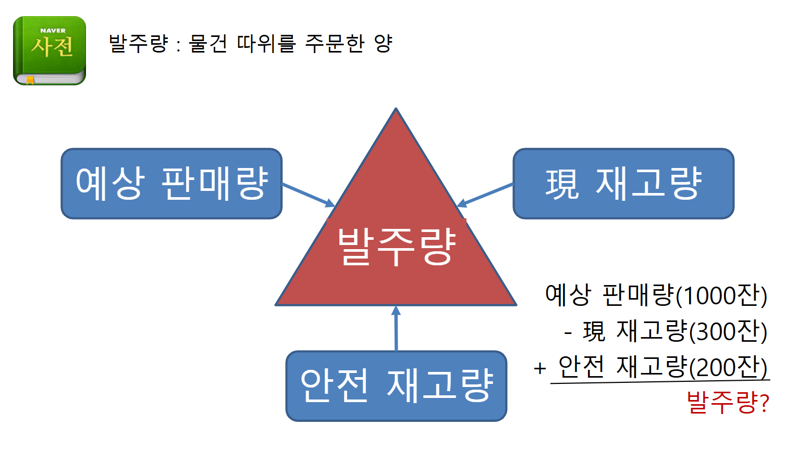

어떤 기준으로 주문을 할 것인가?
1. 한 달 동안 몇 잔 판매할 것인가?
2. 현재 매장에 원두가 얼마나 있는가?
3. 원두 재고를 확보해 놔야겠다. 재고가 없다면 단체 손님이 와도 수요가 있는데도 불구하고 못 파는 경우를 대비해서 

발주량 = 예상 판매량 - 현재 재고량 - 안전 재고량

### 2. 생산관리

- 경영의 생산활동을 능률화하고, 생산경력을 최고로 발휘시키기 위한 관리방법

#### (1) 규모의 경제
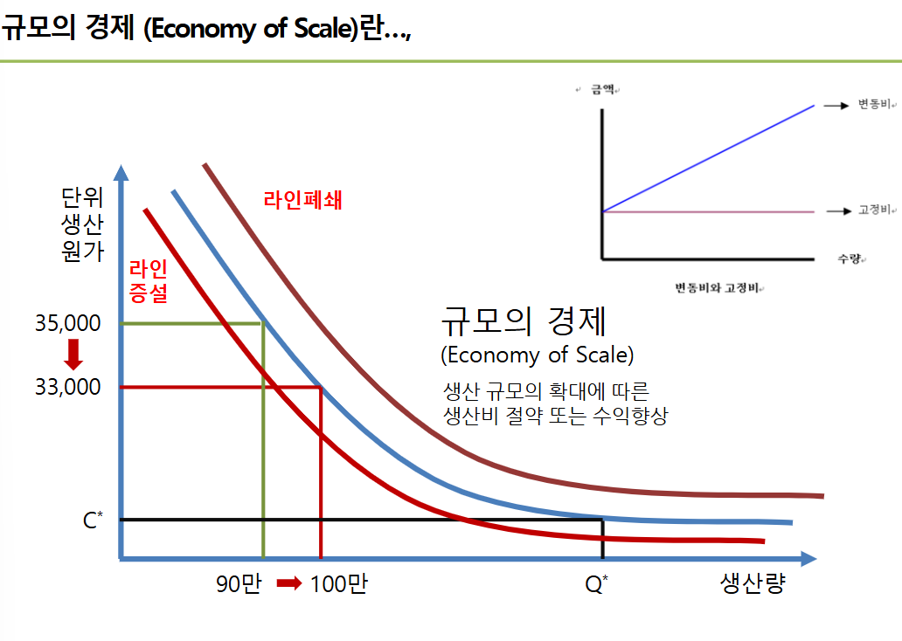
- y 축 : 금액

- x 축 : 수량

* 변동비 , 고정비

단위생산원가 = 총 비용에서 생산량을 나누면

- 생산 규모의 확대에 따른 생산비 절약 또는 수익향상

### 3. 인사관리
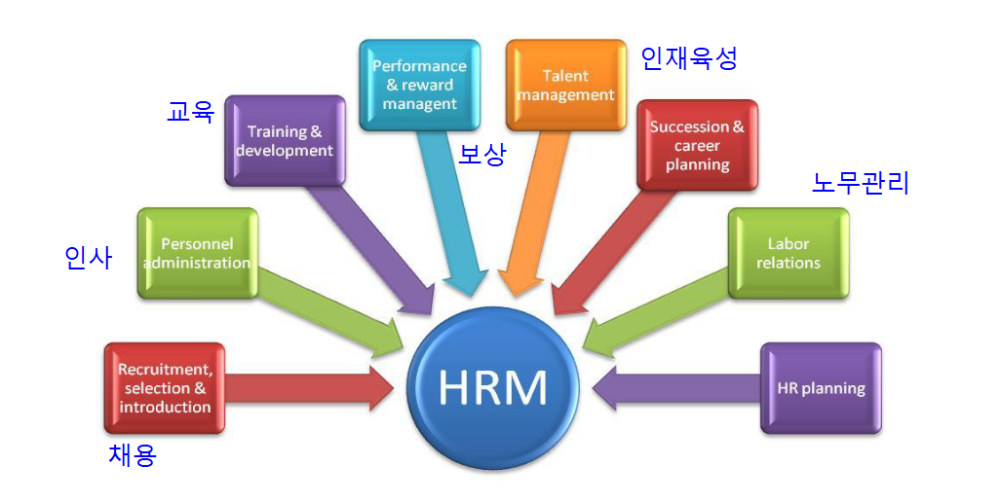

- [기업(조직)의 구성요소인 인적 자원으로, 잠재능력을 최대한 발휘, 최대한의 성과를 달성하여, 만족을 얻게 하려는 체계적인 관리활동]

전공이 뭐야? 회계 언어 하고 있나? 회계는 경영의 언어니까

= 회계를 보려면 경영을 할 수 있으니 전경 불문하고 회계의 기초적인 개념은 숙지해 둬야해.

회계 자료는 숫자로 표현되어 있어요

숫자는 경영 의사결정의 스토리를 가지고 있으니

재무재표를 보고 숫자에 담겨 있는 것을 유추해서 경영활동을 해 봐

### 4. 재무관리
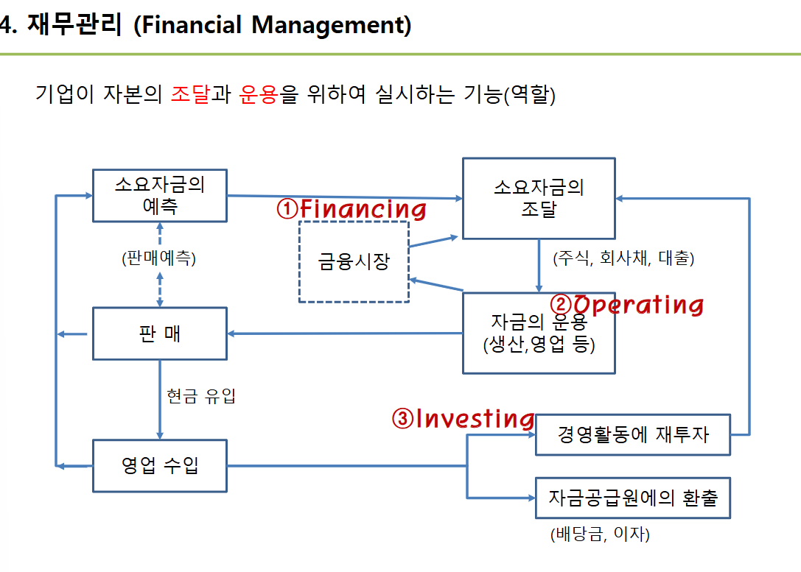
금융시장 Financing -> 자금 운용 Operating -> 투자 Investing

- 내가 커피 매장을 운영한다면?
    사업자금 마련 : 내 돈 (**자본**), 남의 돈 (부채) 이것 으로 마련한 것? -> 자산

    < 회계 등식 >
    자산(**Assets**) = 부채 + 자본
    - 부채 : 갚아야 할 돈, 외상매입금, 은행대출
    - 자본 : 납입 자본금(주식), 이익잉여금

- 재무제표(Financial statement)
: 회사 돈에 대한 정보를 알려주는 여러가지 표
    ⭐ 재무상채표(Statement of Financial Position, B/S : Balance sheet)
    ⭐ 손익계산서(Income Statement)
        - 제조업 : 매출액
        - IT, 서비스업 : 영업수익
    ⭐ 현금흐름표 (Statement of Cash Flows)

#### (1) 📊 손익계산서
: 일정기간 동안의 기업의 경영성과를 한 눈에 나타내기 위하여, 어떤 활동을 통해 수익과 비용을 기록한 재무제표를 말한다.

I       매출액
II      매출 원가
III     매출 총 이익
IV      판매 및 관리비
V       영업이익 = 판매 및 관리비를 뺀 값
VI      영업외 비용
VII     경상이익
XII     당기 순 이익

##### 1. 단계별 계산 공식 (Income Statement Structure)

[ I. 매출액 (Revenue) ]
       │
       ▼  (-) II. 매출원가 (COGS)
[ III. 매출총이익 (Gross Profit) ]
       │
       ▼  (-) IV. 판매비와 관리비 (SG&A)
[ V. 영업이익 (Operating Income) ]  ★ 본업의 성과
       │
       ├─ (+) 영업외수익 (Non-operating Revenue: 이자수익 등)
       └─ (-) VI. 영업외비용 (Non-operating Expense: 이자비용 등)
       │
       ▼
[ VII. 경상이익 (Ordinary Income) ]
       │
       ▼  (-) 법인세 비용 (Corporate Tax)
[ XII. 당기순이익 (Net Income) ]     ★ 최종 남은 돈

----

맞습니다! 회계 실무와 주식 투자에서 "당기순이익만 믿고 투자하거나 판단하면 발등 찍힌다"는 말이 있을 정도로 당기순이익에는 착시와 착오를 일으키는 요소(함정)가 많습니다.

당기순이익을 볼 때 반드시 주의해야 하는 5가지 이유를 정리해 드립니다.

💡 당기순이익을 볼 때 주의해야 하는 5가지 이유
1. ‘일회성 착시’ (본업과 상관없는 착한 척)
상황: 회사가 가진 건물이나 공장 부지를 팔아 1,000억 원의 시세 차익이 생겼습니다.

결과: 본업은 적자인데, 건물 판 돈(영업외수익) 때문에 당기순이익이 엄청나게 흑자인 것처럼 보입니다.

주의점: 건물은 매년 팔 수 없습니다. 이 이익은 지속성이 없는 '일회성 럭키'일 뿐입니다.

2. ‘현금 흐름과의 불일치’ (흑자도산의 위험)
상황: 물건을 100억 원어치 팔아서 '외상(매출채권)'으로 기록했습니다.

결과: 손익계산서상 당기순이익은 100억 원 흑자이지만, 실제 통장에는 돈이 1원도 안 들어왔을 수 있습니다.

주의점: 회계는 '발생주의'를 따르기 때문에, 돈을 못 받아도 이익으로 잡힙니다. 외상이 밀려 통장에 현금이 없으면 흑자인데도 망하는 '흑자도산'이 발생합니다.

3. ‘회계적 조작 및 착시’ (비용을 자산으로 숨기기)
상황: 연구개발(R&D) 비용 50억 원을 썼습니다.

처리 방식:

비용(판관비) 처리 ➡️ 당기순이익 감소

자산(무형자산) 처리 ➡️ 당기순이익에 영향 없음 (순이익 부풀리기)

주의점: 개발비나 마케팅비를 자산으로 잡아 당기순이익을 예쁘게 꾸미는 회사가 있으므로, 재무제표의 주석을 살펴봐야 합니다.

4. ‘주식 수 변동’ (배당/주가 착시)
상황: 당기순이익이 작년 100억 원에서 올해 100억 원으로 똑같습니다.

변수: 그 사이에 회사가 유상증자를 해서 주식 수가 2배로 늘어났다면?

주의점: 주주 한 명당 돌아가는 1주당 순이익(EPS)은 반토막이 난 것입니다. 전체 당기순이익 액수만 보면 이 착시를 놓치게 됩니다.

5. ‘환율 및 평가손익’ (장부상의 숫자일 뿐인 돈)
상황: 달러나 외화 부채, 주식/펀드 자산을 많이 가진 기업.

결과: 평가 환율이 바뀌거나 평가 금액이 올라 장부상 당기순이익이 크게 변합니다.

주의점: 실제로 자산을 팔아 현금화한 것이 아니라 '장부상 평가액'만 바뀐 것이므로 실질적인 기업 가치 상승으로 보기 어렵습니다.

##### 현금 흐름표
현금흐름표는 일정기간 기업의 현금 변동 사항에 대해 확인할 수 있다.
수입과 지출을 영업활동, 재무활동, 투자활동으로 구분한다.

##### 재무상태표

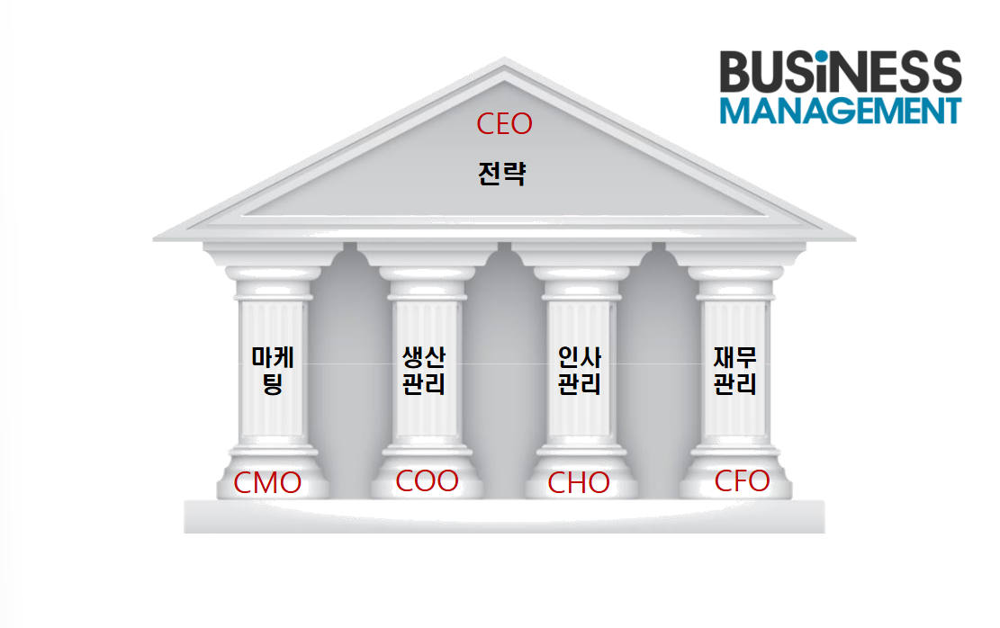

# 경영 시뮬레이션 Biz - Manager 교육
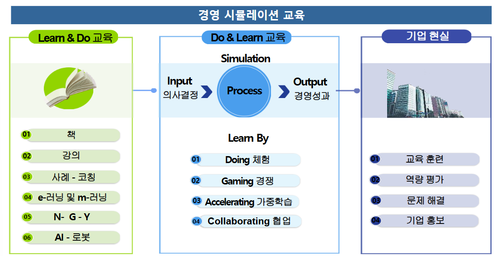
기업 현실과 유사한 상황에서 가상 기업을 경영하는 경영자의 역할을 수행하면서, 자연스럽게 경영의 큰 흐름을 이해하고, 경영성과 창출과 경영의사결정 능력을 성찰하고 향상하는 교육

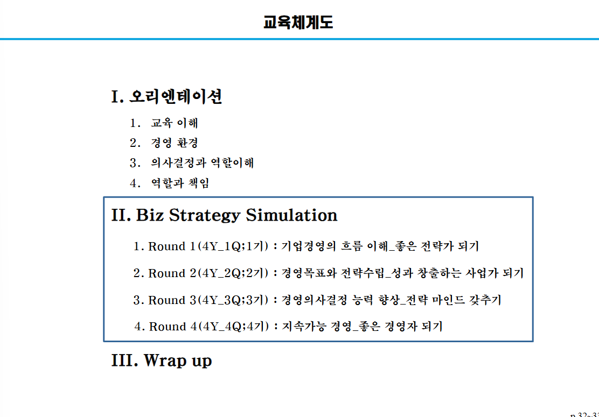

분기로 잘라서 할거야 
분기를 - 1년으로 잡을게
총 4년을 볼거야 

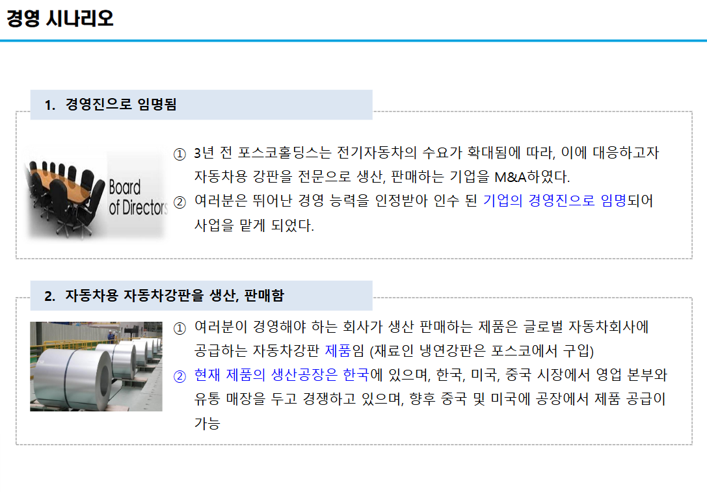 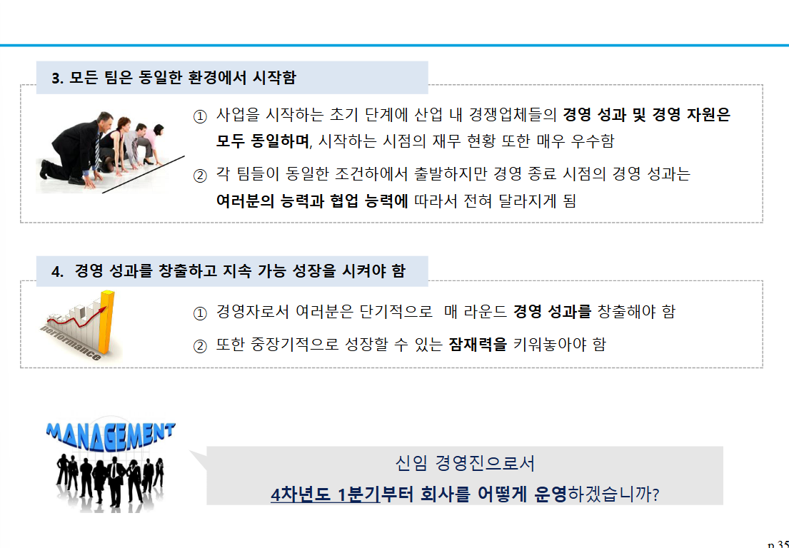
소재는 psco 냉연강판 부품을 자동차 강판으로 만들거임

한국에 생산공정이 있으면 미국 중국엔 없음 그러나 신설 가능
현재 6개 조는 동일하게 경영 성과와 경영 자원은 모두 동일함

고려사항 - 경영 성과를 창출해야함(수익), 성장 잠재력을 키워나야됨.
튼튼한 기업, 성장가능성 부분인데 물려줘야지

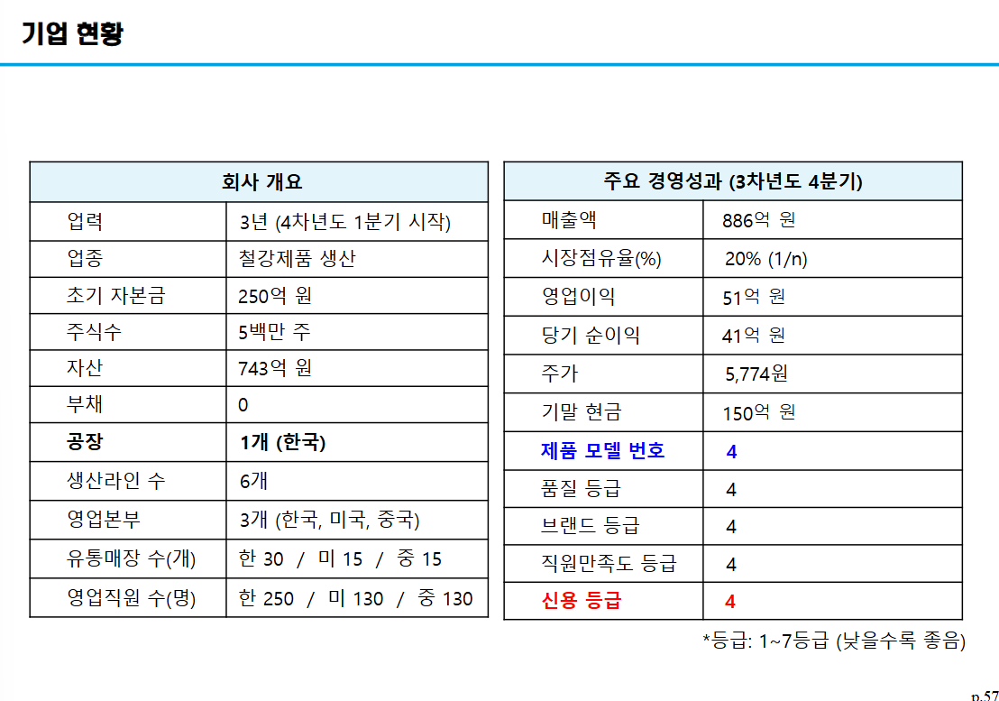

13번째 경영부터 시작
- 철강제품 생산
- 초기 250억
- 주식수 5백만 주   * 5000원 = 250억
-  부채 없음
- 공장은 한국 1개
- 생산라인 수 6개 증설됨 (최대 8개까지 증설 가능(추가 시 비용 발생))
- 영업본부 (한국, 미국, 중국)
- 유통 매장 한국 30 미 15 중 15
- 영업 직원 250 /130/130

신제품은 5 - 6 ------ 가능 ㅇㅇ 현재는 4
품질 등급은 4
1~ 7등급 등급은 낮을수록 좋음

---
13시-14시 회의

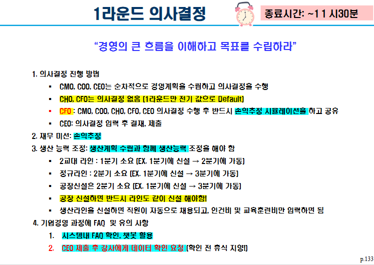
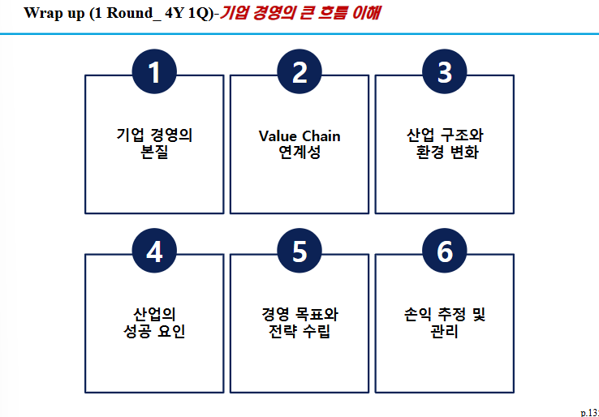

경제환경, 정치/법률 환경, 기술환경, 사회 문화적 환경 등을 봐야해

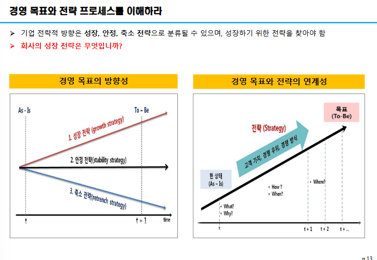
방향성을 정하면 임원들은 그 방향성에 맞게 가야해

성장전략, 안정 전략, 축소 전략 등을 고려해야 함

손익추정, 실제와 비교해 봐.
실제 값들이 찍혀 나옴

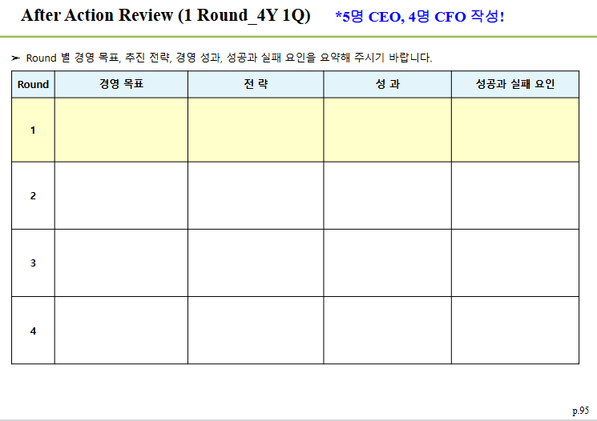

