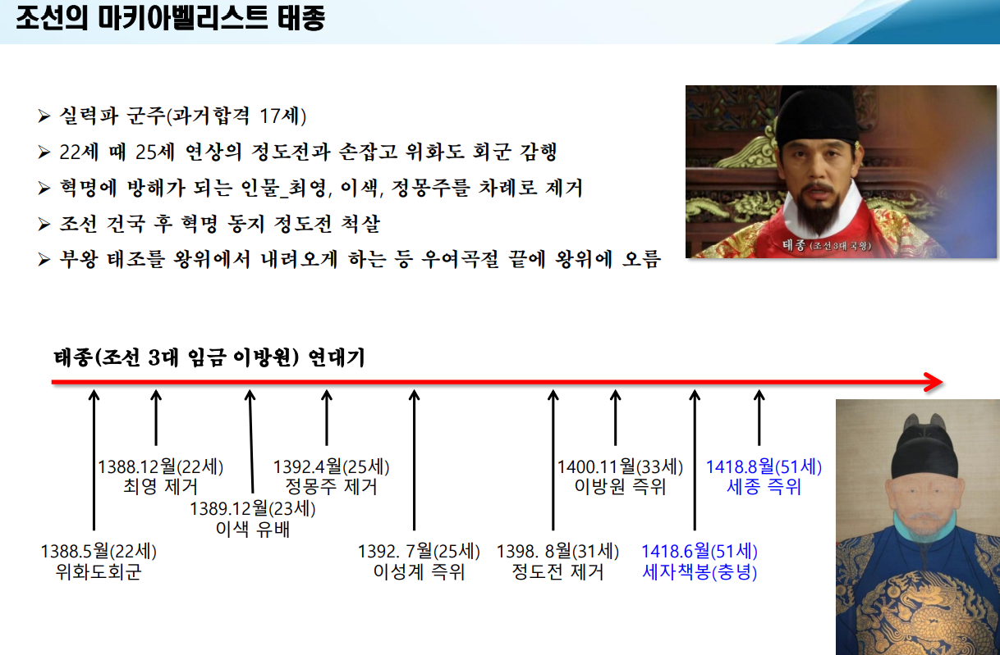
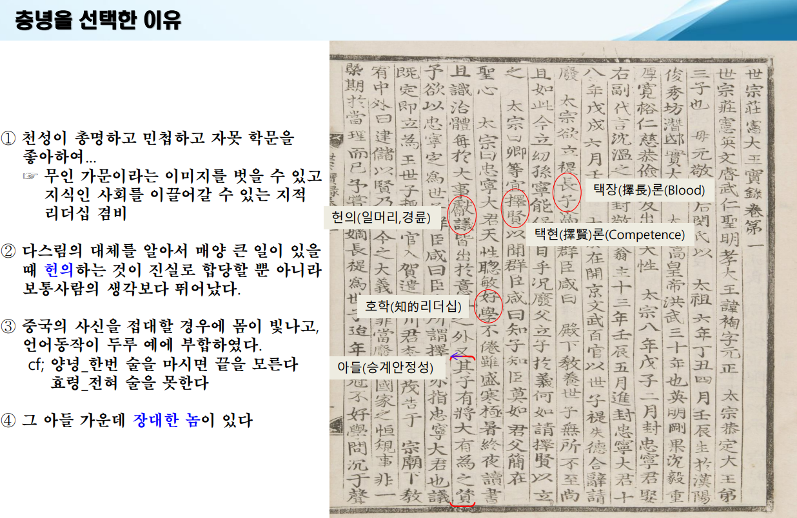

# 리더십과 남다른 일하는 방식 (세종 리더십)

미어캣
멧돼지
매머드 ( 답 : 망아지 )
병아리
바다사자

## 우리가 알고 있는 세종은?
왜 세종은 최고의 임금일까?

▪ 2026년은 세종(이름: 李裪) 즉위 608년이 되는 해임.

▪ 세종은 정치, 경제, 국방, 사회, 과학, 문화 등 위대한 업적을
남겼음에도‘聖君의 메타포’에서 벗어나지 못했음.

▪ 세종이 이루어낸 역사적인 업적을‘리더십과 인간관계’에
입각해 분석함으로써 실천적 모델로 되살려 봄.

즉위 600년 되던 해 2018년 정리하는 그런 모임을 가졌음.

즉위 600년에 만난 세종의 재발견 - 홍성근 - 깨달음

---

< 600년 되던 해 세종 논쟁 발발 >

1. 노비 제도 확장 논쟁 (성군인가, 지주 중심 왕인가?)

논쟁 내용

: 세종 재위 기간에 노비 수가 급증했다는 점을 두고 일어난 비판과 옹호의 대립

비판 측 (이영훈 교수 등)

: 세종이 시행한 '노비종부법(아버지가 신분이 낮으면 자식도 노비가 됨)' 등으로 인해 노비 비율이 폭증했으며, 백성 전체보다는 사대부 양반 기득권을 위한 정책을 폈다는 주장입니다.

반론 측

: 당시 천인 여성과 양반 사이에 태어난 아이들의 패륜·윤리 문제(아버지에 대한 폭행 등)를 해결하기 위한 사회 질서 정비였으며, 백성 대상 17만 명 설문조사, 노비 출산휴가 부여 등 사회 전체를 배려한 정책도 많았기에 단편적 평가라는 입장입니다.

2. 훈민정음 반대 상소 (최만리 vs 세종)

논쟁 내용

: 훈민정음 창제 당시 조정 내 집현전 학자들과 세종 간의 격렬한 대립

최만리 등 사대부의 주장: "중국과 다른 독자적 문자를 만드는 것은 사대주의에 어긋나며, 오랑캐나 만드는 일이다. 기존 이두(吏讀)로도 충분하다."

세종의 반론

: "백성들이 글을 몰라 억울하게 형벌을 받거나 제 뜻을 못 펼치는 것이 안타깝다. 문자 사용을 쉽게 만들어 백성을 이롭게 하는 것이 진정한 위정자의 길이다."

3. 사대주의(명나라 관계) 및 외교 정책

논쟁 내용

: 명나라에 지나칠 정도로 굴종적인 사대 외교를 한 것인가, 실리 외교인가에 대한 논쟁

비판 측: 명나라에 막대한 공녀(여성)와 처녀, 조공(말, 매 등)을 바치며 황제의 눈치를 지나치게 봤다는 시각입니다. (이슬람 문화 및 불교 억압 정책 등도 명나라 눈치 보기의 연장으로 보기도 함)

옹호 측: 신생 국가 조선의 안정을 위해 명나라와의 마찰(의단)을 철저히 피하는 실리 외교였으며, 겉으로는 사대를 취하면서도 내실로는 4군 6진 개척, 고유 역법서《칠정산》 제작 등 독자적 자주 국방과 문화를 구축했다는 평가입니다.

4. 말년의 형벌 강화 및 중벌주의 전환

논쟁 내용

: 세종은 초기에는 형벌을 감경하고 인권적인 법 집행을 선호했으나, 말년에 강력한 형벌 제도로 돌아선 것을 두고 일어나는 평가

내용

: 재위 초·중반에는 형벌을 가급적 온건하게 운영하려 했으나, 소·말 도둑질이나 강력 범죄가 끊이지 않자 재위 20년 이후 중벌주의로 전환하여 낙인(문신)을 찍고 격리하거나 사형 집행 건수가 늘어났습니다. 이를 두고 '이상주의적 국정운영의 한계'라는 분석이 제기됩니다.

---

## 1. 세종의 리더십
### 왜 실록인가? 
" 그 글은 곧았고, 적은 사실은 정확하였으며, 아름다움을 꾸미지 않았고, 악한 것은 숨기지 않았으므로, 그것을 일러 실록이라 하였다." 

- 한서 사마천 -

[ 사마천이 생각하는 지도자의 책무 ]

" 난세를 다스려 올바른 세상으로 되돌리는 것 "

- 올바른 판단기준과 문제를 풀어갈 해법을 역사에서 발견할 수 있다.

- 따라서 역사를 제대로 기록하는 일은 중요하다

[이건희]
50년 된 회사와 5년 된 회사의 결정적인 차이는 바로「과거 데이터」의 차이

### 실록이란?

▪ 역대 제왕의 사적(事蹟)을 편년체로 기록한 책

▪ 춘추관에 소속된 사관들의 사초를 토대로 편찬(左行右言)

[ 좌사 : 왕의 말(언어)를 기록 / 우사 : 왕의 행동(동작,행적)을 기록 ]

▪ 선왕의 실록은 매 3년마다 춘추관의 당상관이 펴서 포쇄하며, 지방은 사관이 포쇄함

▪ 태조~철종 25대 472년까지 현존

( 고종 순종은 일제시대 때 있었던 왕으로 있었다는 것은 실록에 들어갈 수 없음. 있는 사실을 적을 수 없었기에 실록이 아니다. 인정할 수 없어 철종까지 적혀져 있는 것임.)

▪ 국왕은 실록을 [볼 수 없으며], [꼭 필요한 경우 사관이 해당되는 부분만 베껴옴]

“사필(史筆)을 잡는 자는 오로지 사실에 의거해 바르게 기록해야 한다.
찬미하고 비난할 것이 스스로 나타나서 후세 사람들에게
충분히 신뢰받을 수 있어야 한다.”(세종실록 5/12/29)

### 태종의 역사관 엿보기

이지직의 상소 : "검약, 간쟁허용 요청"

태종 : 나의 허물을 비밀히 아뢰어도 내가 다 알아들을 터인데, 이렇게 글을 써서 역사책에 기록하게 하니, 내 가슴이 심히 아프다.

- 조선왕조실록
꾸밈없이 기록된 역사책이 세계엔 없어여 500년의 기록.

궁궐에서 일어난 일 뿐만 아니라 다ㅏㅏ~ 들어가 있어서 야무져~

--

### 세종실록

- 재위 32년 총 163권

- 승하 후 2년 뒤 문종 2년에 편찬을 시작해 단종 2년에 완성( 2년 1개월)

아빠~~~

아, 그 조선시대 최고의 역대급 막장+극적인 ‘세자 교체 프로젝트’ 썰이군요! 딱 맛깔나게 풀어드릴게요.

👑 태종 이방원: "첫째야, 너만 잘하면 된다…"
조선 3대 왕 태종 이방원. 피도 눈물도 없이 적들을 다 쳐내며 왕위에 오른 최고의 스릴러 주인공이죠. 이방원에게는 아들이 여럿 있었는데, 장남(첫째)이 바로 양녕대군이었습니다.

이방원의 계획: "내가 피 흘려서 세운 나라다. 내 뒤는 무조건 제일 똑똑한 첫째가 이어받아서 완벽한 정통성을 세운다!"

그래서 양녕을 어릴 때부터 일타 강사 붙여가며 엄청난 영재 교육을 시켰습니다.

🏹 양녕대군: "아 공부 존나 하기 싫다 진짜!"
문제는 양녕이 공부엔 1도 관심이 없는 일탈의 아이콘이었다는 겁니다.

공부하라고 하면: 병핑계 대고 누워버리기

월담해서: 기생들이랑 술 파티 벌이기

심지어: 남의 유부녀(어리)까지 몰래 궁으로 데려와서 살기

이방원이 참다참다 열받아서 "너 진짜 정신 안 차릴래?!" 하고 몽둥이를 들면, 양녕은 반성문 써놓고 돌아서서 또 딴짓을 했습니다. 이방원의 혈압은 매일 최고치를 갱신했죠.

📚 충녕대군(훗날 세종): "아버님, 책 더 없나요?"
반면, 셋째 아들 충녕대군(세종)은 완전히 다른 세상 캐릭터였습니다.

취미: 독서

특기: 밤새워서 독서

특이사항: 눈병 나서 아버지가 책을 다 뺏어 숨겼더니, 병풍 뒤에 떨어진 책 한 권을 수십 번 다시 읽음.

이방원이 충녕을 보고 속으로 무슨 생각을 했을까요?
'저놈은 누구 닮아서 저렇게 똑똑하고 진중하지? (지 닮음)'

양녕이 자꾸 사고를 치니까, 은근히 셋째 충녕에게 정치적 질문을 던지며 간을 보기 시작합니다. 충녕도 눈치가 100단이라, 세자 자리를 노리는 것처럼 보이지 않으면서도 완벽한 정답만 쏙쏙 내놓았죠.

💥 결정적 사건: "첫째 손절, 셋째 가자!" (1418년)
결국 양녕의 유부녀 스캔들과 끝없는 기행으로 이방원의 참을성이 바닥을 쳤습니다. 신하들도 "세자를 바꿔야 합니다!"라며 들고일어났죠.

이방원은 눈물을 흘리며(사실 속으로는 이미 계산 끝남) 선언합니다.

"양녕은 세자 자리에서 폐한다! 그리고 나라의 미래를 위해… 셋째 충녕을 세자로 삼는다! (충녕 가자~!)"

당시 조선 규칙상 세자를 바꾸는 건 엄청난 일이었지만, 이방원의 추진력 앞에선 아무도 태클을 걸 수 없었습니다.

충녕은 세자로 지목된 지 단 두 달 만에 빠른 속도로 왕위에 오르게 됩니다. 그게 바로 세종대왕입니다!

👴 상왕 이방원: "왕은 네가 해, 피는 내가 묻힐게"
왕위에 오른 세종! 하지만 이방원은 그냥 물러난 게 아니라 ‘상왕(왕의 아버지)’으로 뒤에 든든하게 앉아 있었습니다.

역할 분담:

세종: 백성들을 위한 정책, 한글 연구, 과학 발전, 학문 연구 (훈훈한 태평성대 모드)

상왕 이방원: 군사권 딱 쥐고, 세종의 장인(심온)을 포함해 세종에게 위협이 될 만한 외척과 권력자들을 미리 싹 다 정리해 줌 (혈투 피바다 모드)

결국 이방원이 세종의 정치적 정적과 걸림돌을 미리 싹 다 제거해 준 덕분에, 세종대왕은 아무런 정치적 위협 없이 오롯이 백성과 나라를 위한 업적에만 집중할 수 있었던 겁니다.

### 태종의 전위 리더십
👑 태종의 세종(충녕) 후계자 강화 전략
태종 이방원은 단순히 왕위를 물려주는 데 그치지 않고, 후계자가 최고의 왕권을 행사할 수 있도록 학문·인심·정치·경제·외교 전 방위에서 판을 깔아주는 주도면밀한 전위 리더십을 보여주었습니다.

보내주신 노트는 태종 이방원이 셋째 아들 충녕(세종)에게 왕위를 넘겨주면서 추진한 ‘역대급 세종 만들기(왕권·민심·국정 기반 강화) 프로젝트’의 핵심을 아주 정확하게 짚고 있는 내용입니다.

이 노트를 역사적 맥락과 함께 하나씩 풀어 드리겠습니다.

1. 학문적 정통성과 명분 확보 (서연관 설치)
내용: 세자 교육 기관인 서연(書筵)에 뛰어난 학자들(서연관)을 배치하고 세자 교육을 대대적으로 진행했습니다.

의도: 셋째 아들이 왕위에 오르는 명분 약점을 극복하기 위함이었습니다. "충녕은 학문과 지혜가 독보적이다"라는 점을 성리학적 지식인(사대부)들에게 직접 증명해 보여서 유학자들의 마음을 사로잡고 전폭적인 지지를 끌어냈습니다.

2. 세자에 대한 무한한 신뢰 (대중적 인심 확보)
내용: 세자 책봉 직후, 대신들과 사대부들이 언제든 자유롭게 세자를 만나 이야기를 나눌 수 있도록 길을 열어주었습니다.

의도: 충녕의 인품, 정세 판단력, 온화함 등을 신하들이 직접 경험하게 하여 "과연 새 왕이 될 자격이 충분하구나" 하는 자발적 신망과 충성심을 얻게 만들었습니다.

3. 악역 자처 및 궂은일 마무리 (책임 감당)
밀려있는 공사 마무리: 백성들에게 부담이 되는 대규모 토목공사나 궂은 행정 과제들을 태종 자신이 재위 기간 끝자락에 서둘러 끝냈습니다. 백성들의 원성은 자신이 다 안고 가고, 세종은 깨끗하고 덕망 높은 '덕치(德治)'의 상징으로 출발하게 해준 것입니다.

내외척 제거 (ex: 심온): 세종의 장인이자 영의정이던 심온 일가를 제거하는 등, 미래에 왕권을 위협할 만한 외척 세력을 자신의 손으로 싹 잘라냈습니다. 세종에게 정치적 부담이나 피를 묻히지 않게 하려는 냉혹하면서도 철저한 사랑이었습니다.

4. 개혁을 통한 탄탄한 경제력 확보 (문화정치 기반)
내용: 호패법(인구·세원 파악), 화폐 개혁, 군제 개혁 등을 통해 국가 재정을 획기적으로 확충했습니다.

결과: 서울과 지방의 국고(창고)가 곡식과 재화로 가득 차게 되었습니다.

의도: 나라에 돈이 풍족했기 때문에 훗날 세종이 훈민정음 창제, 집현전 학사 지원, 각종 천문·과학 기구 제작 등 막대한 예산이 들어가는 '문화정치'를 마음껏 펼칠 수 있었습니다.

5. 정치범 석방 (민심 회복 및 정치적 리셋)
내용: 태종 자신이 집권하고 왕권을 강화하는 과정에서 처벌하거나 유배 보냈던 수많은 정치범들과 인재들을 대사령(대규모 사면)을 통해 풀어주었습니다.

의도: 피비린내 나는 권력 투쟁의 시대를 끝내고, 세종 시대에는 '화합과 통합'의 정치를 펼칠 수 있도록 판을 새로 깔아준 것입니다. (이때 사면된 인물 중 대표적인 사람이 훗날 명재상이 된 [황희]입니다.)

---
#### 황희
황희(黃喜, 1363~1452)는 세종대왕 시대를 대표하는 최고의 명재상이이자, 조선 왕조 전체를 통틀어 가장 오랜 기간(18년) 영의정 자리를 지킨 인물입니다.

1. 세종의 철저한 신임을 얻은 영의정
18년간 영의정 재임: 세종 재위 기간 동안 약 18년 동안 최고 관직인 영의정에 있으면서 국정 전반을 총괄했습니다.

충직한 간언과 조정 능력: 신하들과 왕 사이에서 탁월한 중재자 역할을 했으며, 국방, 농업, 법제, 세제(공법) 등 세종의 대대적인 개혁 정책들이 현실에서 잘 작동하도록 완성한 주역이었습니다.

2. 반대파에서 든든한 조력자로
충녕대군(세종) 세자 책봉 반대: 원래 태종 시절, 첫째 아들 양녕대군을 세자에서 몰아내고 셋째인 충녕대군을 세자로 세우려 할 때 "장자를 두고 셋째를 세우는 것은 유교적 법도에 맞지 않는다"며 강력히 반대했습니다.

유배와 복귀: 이 사건으로 태종의 노여움을 사 파직되고 유배를 갔으나, 세종이 즉위한 후 황희의 인품과 능력을 높이 평가하여 그를 다시 불러들여 중용했습니다.

3. 세종과의 재밌는 관계: "사직서 반려의 아이콘"
황희는 나이가 들고 몸이 아파 세종에게 수없이 "나이가 많으니 사직하게 해주십시오" 하고 사직서를 올렸습니다.

하지만 세종은 그때마다 지팡이, 가마, 고기 반찬 등을 하사하며 "대신의 자리를 비울 수 없다"며 사직서를 번번이 반려(거절)했습니다. 결국 황희는 86세가 되어서야 겨우 관직에서 물러날 수 있었습니다.

4. 청백리(淸白吏)의 대명사
검소한 삶: 최고 관직인 영의정에 있으면서도 집이 비가 샐 정도로 가난하고 검소하게 살았다는 전설적인 에피소드가 많습니다.

유명한 야사 (관용과 배려):

검은 소와 누렁이 소: 길을 가다 농부에게 " 어느 소가 일을 더 잘하오?"라고 물었을 때, 농부가 소가 들을까 봐 귓속말로 답하자 짐승의 마음까지 배려하는 법을 깨달았다는 이야기.

"네 말도 맞고, 네 말도 맞다": 종들의 다툼을 중재할 때 모두의 입장을 이해해 주는 인자한 성품을 보여준 에피소드.

5. 역사적 평가
조선의 기틀을 다진 실무 능력이 탁월한 정치가이자, 관용과 품격을 갖춘 명재상이었습니다.

세종대왕이 마음 놓고 훈민정음 창제, 과학 기술 발전, 영토 개척 등 '문화정치'에 집중할 수 있도록 백성들의 민생과 행정을 안정적으로 지탱해 준 든든한 버팀목이었습니다.
---

6. 대중국 외교 문제 완결 (세종 4년 말 1만 마리 교역)
내용: 명나라와의 까다롭고 민감했던 외교 마찰(명나라가 요구한 군마(軍馬) 1만 마리 조공 및 교역 문제 등)을 상왕으로 있던 태종과 세종 초기에 완벽하게 마무리 지었습니다.

의도: 강대국 명나라와의 대외적 마찰과 외교적 리스크를 사전에 완전히 해결해 놓음으로써, 세종이 대외 위협 없이 오롯이 내정과 북방 개척(4군 6진)에만 집중할 수 있는 환경을 만들어 주었습니다.

<<용의 눈물>>
이방원-세종-황희 이야기의 정점을 찍는 명작 레전드 사극 

조선 건국부터 태종 이방원의 집권, 그리고 충녕대군(세종)에게 왕위를 넘겨주는 전위 과정
-

[내가 모든 악업을 안고 갈 것이니, 주상은 오직 성군이 되어 태평성대를 누리시오 에 대한 이방원의 진심]
- "피는 내가 묻힌다 (독박 악역)"

왕권을 위협할 정적과 외척을 제거하는 냉혹한 비난과 원한은 내가 모두 짊어지고 죽겠다는 각오입니다.

"아들은 꽃길만 걸어라 (완벽한 환경 조성)"

세종이 정쟁이나 위협에 흔들리지 않고, 오롯이 학문과 민생에만 집중할 수 있는 깨끗한 판을 만들어 주려는 어버이의 마음입니다.

"조선의 미래를 위한 계산된 사랑 (국가적 대의)"

단순한 아들 사랑을 넘어, 자신의 '칼과 피'로 기틀을 다져 아들의 '덕과 학문'을 통해 조선 최초의 태평성대를 완성하겠다는 철학입니다.

-

외척이란? ➡️ 왕의 장인, 처남, 외삼촌 같은 '부인/어머니 쪽 친척'

심온은 누구? ➡️ 세종대왕의 장인(왕비 소헌왕후의 아버지)

왜 죽였나? ➡️ 태종이 "아들 세종의 왕권을 위협할까 봐" 미리 장인을 제거해 버린 것

---

헌의 (일머리, 경륜)

택장론 ( blood )

택현론 ( competence )

호학 ( 리더십 )

아들 ( 승계안정성 )

---

## 사람관리

- 오펜하이머
    세대차와 학문의 대립

    아인슈타인은 상대성이론의 거장, 오펜하이머는 양자역학 세대의 선두주자였습니다.

    아인슈타인이 확률 기반의 양자역학을 완벽히 받아들이지 않아 학문적 거리는 다소 있었습니다.

    원자폭탄 개발과 죄책감 공유

    아인슈타인의 편지로 맨해튼 프로젝트가 시작됐고, 총지휘는 오펜하이머가 맡았습니다.

    두 사람 모두 자신의 학문이 인류를 파멸시킬 무기가 되었다는 지독한 죄책감을 공유했습니다.

    정치적 수난 속의 우정

    오펜하이머가 사상 검증 청문회로 고초를 겪을 때, 아인슈타인은 "자네를 사랑하지도 않는 미국 정부를 왜 쫓아다니냐"라며 안타까워하고 조언을 아끼지 않은 든든한 조력자였습니다.

- 루이스 스트로스

### 세종의 리더십 _ 관계경영

"인재를 알아보는 일이 가장 어렵다." - 허조-

"어느 시대인들 사람이 없으랴 했거니와, 지금도 역시 사람은 반드시 있을 것이로되, 다만 알아보고 쓰는 것을 못할 따름이다." -세종실록(20/4/28)-

## 2. 세종의 일하는 방식
