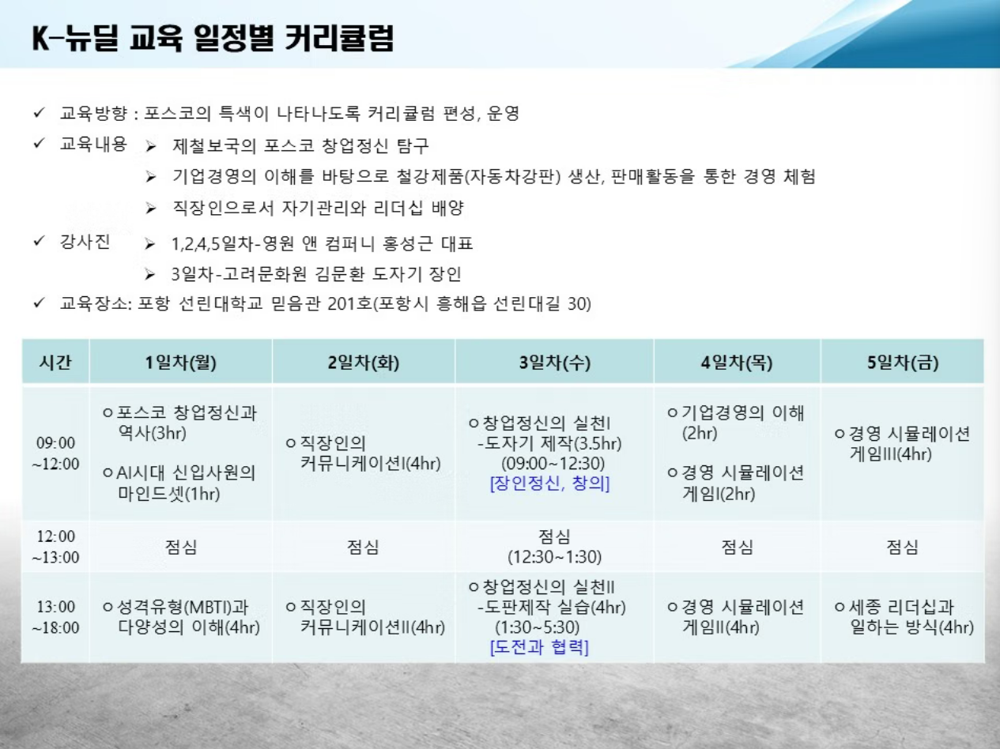

26.07.20~24 (3주차)

강사 : 홍성근 대표

### 교육 방향 : 포스코 특색이 나타나도록 커리큘럼 편성, 운영
### 교육내용 
- 제철보국의 포스코 창업정신 탐구
- 기업경영의 이해를 바탕으로 철강제품(자동차강판) 생산, 판매활동을 통하 경영 체험
- 직장인으로서 자기관리와 리더십 배양

### 1일차 
- 포스코 창업정신과 역사 / AI시대 신입사원의 마인드셋, 성격 유형과 다양성의 이해

### 2일차 
- 직장인의 커뮤니케이션 / 직장인의 커뮤니케이션
* 사회인으로서 신입사원 마인드셋

### 3일차
- 창업정신의 실천 (도자기 제작/ 장인정신. 창의)
* 체험을 하면 좋겠다고 생각을 해서 도자기 제작을 해볼 예정이에요 
기억에 남는 시간이 될거에요
오늘 창업정신에서 -> 장인정신 창의력을 담아서 만들어볼거야
개념이 있고 없고 차이가 있어

### 4일차
- 기업경영의 이해
- 경영 시뮬레이션 게임
* 4개 조로 도판을 제작할 거야. 협동을 위해서 (협력/도전)
각각의 인생이지만 하나의 작품을 만들어 볼거에요
신선하고 도움이 될거에요

### 5일차
- 경영 시뮬레이션 게임
- 세종 리더십과 일하는 방식
* 인터넷 게임인데요, 6개 조 -> 각각의 기업 
정신 - AI까지 세종의 정신으로 어떻게 이끌어내는지 봐줭